# 模型管理平台 · 系统使用文档

> **版本**：v3.0 ｜ **编写日期**：2026-09-20 ｜ **适用系统**：模型管理平台（Vue3 + Flask + MySQL）
>
> **读者对象**：使用平台的工厂人员、验收老师、后续接手维护的同学。
>
> ⚠️ **本文以「实验室交付主机」的实际部署为准**（路径、端口、服务名、MySQL 位置均按该机填写）。
> 若在其他机器上部署，只需替换**路径与端口**，功能与操作步骤完全一致——
> 参数对照见 [9.6 运行环境参数对照](#96-运行环境参数对照)。
>
> **本文特点**：全文截图均来自**真实运行的系统**，接口返回值是**真实调用结果**。
> 凡是"尚不具备"的能力，本文都会明确写出**当前状态**，不做夸大。

---

## 目录

- [1. 平台简介](#1-平台简介)
- [2. 运行环境与启动方式](#2-运行环境与启动方式)
- [3. 登录与账号体系](#3-登录与账号体系)
- [4. 功能模块操作说明](#4-功能模块操作说明)
  - [4.1 首页（平台概览）](#41-首页平台概览)
  - [4.2 模型发布（已发布模型包）](#42-模型发布已发布模型包)
  - [4.3 模型管理](#43-模型管理)
  - [4.4 数据集管理](#44-数据集管理)
  - [4.5 数据展示](#45-数据展示)
  - [4.6 系统管理](#46-系统管理)
  - [4.7 用户管理（管理员专属）](#47-用户管理管理员专属)
  - [4.8 操作日志（管理员专属）](#48-操作日志管理员专属)
- [5. 模型调用方式](#5-模型调用方式)
  - [5.1 调用链路总览](#51-调用链路总览)
  - [5.2 方式一：界面调用](#52-方式一界面调用)
  - [5.3 方式二：HTTP 接口调用](#53-方式二http-接口调用)
  - [5.4 方式三：Python 代码调用](#54-方式三python-代码调用)
- [6. 模型发布与外部使用](#6-模型发布与外部使用)
- [7. 权限体系说明](#7-权限体系说明)
- [8. 部署与运维](#8-部署与运维)
- [9. 常见问题排查](#9-常见问题排查)
- [10. 当前能力边界与遗留事项](#10-当前能力边界与遗留事项)
- [附录 A：数据库表结构速查](#附录-a数据库表结构速查)
- [附录 B：接口速查](#附录-b接口速查)
- [附录 C：文档版本记录](#附录-c文档版本记录)
- [附录 D：实验室主机文件结构](#附录-d实验室主机文件结构)

---

## 1. 平台简介

本平台把**轴承振动数据 → 模型训练 → 模型产物 → 在线推理 → 结果落库 → Web 展示 → 打包发布**串成一条完整且可追溯的链路。

它不是只做界面展示的演示 Demo，而是一条**有数据库、有产物管理、有权限控制、有审计记录、可离线部署**的真实通路。

### 1.1 核心能力

| 能力 | 说明 |
|---|---|
| **模型管理** | 模型清单、上传模型、训练、推理、训练记录、推理任务与结果明细、模型档案、改名、删除产物 |
| **模型发布** | 把训练好的模型打包成 zip（含权重、`meta.json`、`README.md`、`requirements.txt`、`example_infer.py`），提供下载供外部机器使用；已发布包集中展示与下载 |
| **数据集管理** | 内置 CWRU 数据集体检、表格数据集上传、信号列预览与统计 |
| **数据展示** | 信号波形可视化、训练与推理自动生成的图（混淆矩阵、训练曲线、异常时序） |
| **系统管理** | 运行环境与依赖、数据库 11 张表行数、日志查看、接口索引、维护操作 |
| **用户管理** | 管理员专属：账号列表、新建 / 编辑 / 重置密码 / 停用启用、按角色控制菜单可见性 |
| **操作日志** | 管理员专属：全平台操作审计查询，按动作/结果/关键字筛选，详情结构化展示 |

> **关于边缘端**：模型如何下发到产线设备，另见独立文档
> **《边缘端接入设计方案》**（`docs/边缘端接入设计方案.md`）。
> 该文档说明设备鉴权、心跳、模型下发与结果回传的设计，
> 并**明确列出不做的事**（PLC 对接、断网自治）与**真实局限**（模型格式需转换）。
> ⚠️ 该文档是**设计方案**，边缘端功能**尚未实现**。
| **权限控制** | 三级角色（管理员 / 工程师 / 操作员），后端接口强鉴权 + 前端按钮级隐藏 |
| **审计能力** | 登录 / 登出 / 改密 / 用户管理 / 模型上传·删除·改名 / 模型发布·取消发布 / 数据集上传·登记 / 训练 等操作落库（`OperationLogs` 表） |
| **可追溯** | 每次训练 / 推理都写库留痕，**失败路径也留记录** |
| **运维能力** | 单服务集成前端、Windows 服务化（NSSM）开机自启 + 崩溃自动重启 |

### 1.2 三个内置模型

| 模型 | 类型 | 框架 | 说明 | 实测指标 |
|---|---|---|---|---|
| `1DCNN` | 分类 | TensorFlow / Keras | CWRU 十类故障分类 | 测试准确率 **0.9457** |
| `cwt_cnn` | 分类 | PyTorch | 与 1DCNN 同任务的另一实现 | 测试准确率 **0.6680** |
| `adtk` | **无监督异常检测** | adtk（PcaAD） | 只需一段"正常"基线信号 | 正常文件 **0/5 误报**，故障文件 **5/5 命中** |

### 1.3 系统架构

```
┌──────────────────────────────────────────────┐
│   单端口服务（waitress）  http://<IP>:5000     │
│                                              │
│   ┌────────────────────────────────────┐     │
│   │  Flask + flask-restful             │     │
│   │  testRestfulProject/serve.py       │     │
│   │                                    │     │
│   │  ├ model_service/api.py      业务接口│     │
│   │  ├ model_service/auth.py     鉴权   │     │
│   │  ├ model_service/web.py      静态托管│     │
│   │  ├ model_service/training.py 训练   │     │
│   │  ├ model_service/inference.py 推理  │     │
│   │  ├ model_service/exporter.py 发布   │     │
│   │  └ model_service/registry.py 产物   │     │
│   └────────────────────────────────────┘     │
│                    │                         │
│        ┌───────────┴───────────┐             │
│        ▼                       ▼             │
│   /api/** 接口          其余 → index.html    │
│   （JSON）              （Vue Router 接管）   │
└──────────────────────────────────────────────┘
                     │
                     ▼
        ┌─────────────────────────┐
        │  MySQL 8.0              │
        │  model_management       │
        │  11 张表                 │
        └─────────────────────────┘
```

> **架构要点**：前端打包产物（`frontend/22project/dist`）由**后端直接托管**，
> 因此对外**只有一个端口**（实验室主机上为 **5000**），不需要 nginx，也不需要单独跑一个前端服务。
> 这对工厂内网/离线环境极其重要——部署时只需要起一个服务。

---

## 2. 运行环境与启动方式

> ⚠️ 本章数据**取自实验室交付主机的实际部署**。

### 2.1 环境要求

| 组件 | 版本要求 | 实验室主机的实际值 |
|---|---|---|
| Python | 3.10+ | 3.12.4（位于 `testRestfulProject\venv`，随项目携带） |
| MySQL | 8.0+ | 8.0，库名 `model_management`；程序在 `C:\Program Files\MySQL\MySQL Server 8.0\bin\` |
| Node.js | 18+（**仅改前端时需要**） | 生产运行时**不需要** |

> 生产运行时**不需要 Node.js**——前端已经打包成静态文件由后端托管。
> 只有在修改前端源码后，才需要 Node.js 重新构建。

**关键路径一览（实验室主机）**：

| 项 | 路径 |
|---|---|
| 项目根目录 | `D:\offline_package\04-program-code\testRestfulProject` |
| 前端源码 | `D:\offline_package\04-program-code\frontend\22project` |
| 虚拟环境 Python | `testRestfulProject\venv\Scripts\python.exe` |
| MySQL 客户端 | `C:\Program Files\MySQL\MySQL Server 8.0\bin\mysql.exe` |
| 备份目录 | `D:\Backup\ModelManage\` |

> 💡 **为什么项目在 `D:\offline_package\04-program-code\` 下**：这台机器是**离线部署**的，
> 所有安装材料（MySQL 安装包、Python、离线 wheel 包、项目源码）都从一个叫
> `offline_package` 的目录里展开。`04-program-code` 是其中的"程序代码"分区。
> 目录名只是部署时的约定，**移到别处也能跑**，但移动后需要同步修改 NSSM 服务的
> "启动目录"与备份脚本里的路径（见 §8.2）。

### 2.2 数据库配置

`testRestfulProject/db.env` 是唯一的配置入口：

```ini
MODEL_DB_DIALECT=mysql
MODEL_DB_HOST=127.0.0.1
MODEL_DB_PORT=3306
MODEL_DB_USER=root
MODEL_DB_PASSWORD=<你的密码>
MODEL_DB_NAME=model_management

# 令牌签名密钥（固定值，重启不掉线）
# 用 secrets.token_hex(32) 生成
MODEL_SECRET_KEY=<64 位十六进制随机串>
```

> ⚠️ **`MODEL_SECRET_KEY` 必须配置**。不配置时后端每次启动会随机生成密钥，
> 现象是"重启服务后所有人被踢下线"，在现场演示时会被误认为系统不稳定。
> 启动日志中出现 `未配置 MODEL_SECRET_KEY，本次启动使用随机密钥（重启后需要重新登录）`
> 就说明**还没配**；配置正确时该警告不会出现。

> ⚠️ 本平台**只连 MySQL，没有兜底库**。`MODEL_DB_DIALECT` 配成 `mysql` 以外的值会在启动时直接报错——
> 这是刻意的：宁可启动失败，也不要让系统悄悄写进一个临时库、第二天数据全没了。

**生成一个密钥**：

```powershell
cd D:\offline_package\04-program-code\testRestfulProject
venv\Scripts\python.exe -c "import secrets; print(secrets.token_hex(32))"
```

把输出粘贴到 `db.env` 的 `MODEL_SECRET_KEY=` 后面即可，然后重启服务。

### 2.3 启动方式

> **实验室主机的常态是"服务自启"**：由 NSSM 注册成 Windows 服务
> （服务名 **`ModelManageService`**），开机自动运行、崩溃自动重启。
> **日常使用无需手动敲任何命令**，浏览器打开地址即可。
> 下面两种方式是**调试/排障时**才用的。

#### 方式一：生产模式（手动启动，排障用）

```powershell
cd D:\offline_package\04-program-code\testRestfulProject
venv\Scripts\python.exe serve.py --port 5000
```

`serve.py` 用 **waitress** 起一个 WSGI 服务。启动后应看到：

```
  模型管理平台 · 生产模式（waitress）
  监听地址   : 0.0.0.0:5000
  工作线程   : 4
  数据库     : 127.0.0.1:3306/model_management
```

浏览器打开 **<http://127.0.0.1:5000>** 即可使用。

> ⚠️ **端口必须显式写 `--port 5000`**。`serve.py` 的默认端口是 `8080`，
> 而本平台在实验室主机上以 **5000** 部署（服务名 `ModelManageService` 与端口 5000 配套）。
> 不写 `--port` 会监听 8080，与平台地址不一致。
> 端口相关的说明见 [9.6 运行环境参数对照](#96-运行环境参数对照)。

常用参数：

```powershell
venv\Scripts\python.exe serve.py --port 5000 --threads 8   # 换线程数
venv\Scripts\python.exe serve.py --host 127.0.0.1 --port 5000  # 只监听本机
```

#### 方式二：开发模式（改后端代码时用）

```powershell
venv\Scripts\python.exe main.py
```

`main.py` 带热重载和调试器，改代码自动重启；但它**不托管前端**，
需要另外跑 `npm run dev` 启动 Vite（此时前端在 8080，后端在 5000，两者靠 CORS 通信）。

> **两种模式的区别**：生产模式是"一个端口搞定一切"，开发模式是"两个端口、改代码自动生效"。
> 交付/演示用生产模式（或直接交给 NSSM 服务），改代码用开发模式。

### 2.4 访问地址一览

| 地址 | 说明 |
|---|---|
| <http://127.0.0.1:5000> | 平台前端（日常操作入口） |
| <http://127.0.0.1:5000/health> | 健康检查（含数据库连接状态） |
| <http://127.0.0.1:5000/api> | 接口索引（JSON） |
| `http://<本机IP>:5000` | 局域网其他机器访问（需放行防火墙，见 §8.3） |

**查看本机 IP**：

```powershell
ipconfig | Select-String "IPv4"
```

---

## 3. 登录与账号体系

### 3.1 登录界面


在登录页输入账号密码即可。系统采用**服务端密码哈希**（`pbkdf2:sha256`），
数据库中不存明文密码。

### 3.2 三个内置账号

| 账号 | 默认密码 | 角色 | 用途 |
|---|---|---|---|
| `admin` | `Admin@2026` | 超级管理员 | 给老师的主账号，拥有全部权限 |
| `engineer` | `Engineer@2026` | 算法工程师 | 训练 / 推理 / 发布 / 删除模型 |
| `operator` | `Operator@2026` | 现场操作员 | 只能看和跑推理 |

> ⚠️ **默认密码必须在正式投入使用前修改**。修改方式见 [7.3 修改密码](#73-修改密码)。

### 3.3 密码传输说明

前端**不对密码做本地哈希**，直接提交给后端，由后端用 `pbkdf2:sha256` 加盐哈希后存库。

> **为什么不在前端做哈希**：
> ① 若前端与后端使用不同算法，会导致**无法登录**；
> ② 固定摘要算法（如 MD5）等于把密码变成另一个固定短密码，抓包拿到后可重放，
> 并不能真正提升安全性。真正的安全来自**传输层加密（HTTPS）**与**服务端慢哈希**。
> 因此正确做法是：前端传明文（依赖 HTTPS 保护），后端负责加盐哈希。

---

## 4. 功能模块操作说明

### 4.1 首页（平台概览）

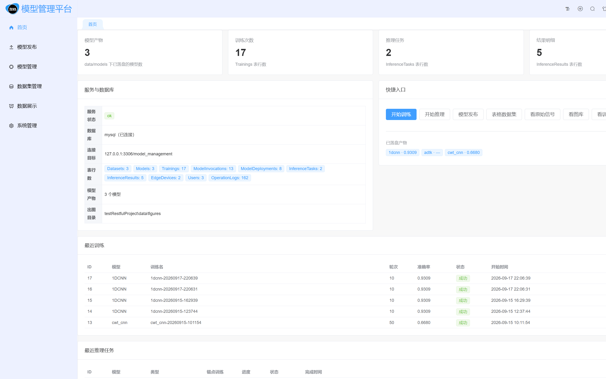

首页是平台的入口总览，顶部为功能导航（首页 / 模型发布 / 模型管理 / 数据集管理 / 数据展示 / 系统管理），
中部是平台概览卡片与快捷操作按钮：

| 快捷入口 | 作用 |
|---|---|
| **开始训练** | 跳到模型管理的「训练」页签 |
| **开始推理** | 跳到模型管理的「推理」页签 |
| **模型发布** | 跳到「模型发布」页面，查看已发布的模型包 |
| **表格数据集** | 跳到数据集管理的「表格数据集」页签 |
| **看原始信号** | 查看数据集原始波形 |
| **看图库** | 查看训练/推理自动生成的图（混淆矩阵、训练曲线等） |
| **看训练日志** | 查看训练过程日志 |

> **界面上看不到某个按钮？** 先确认当前账号的角色。
> 例如 `operator` 账号看不到「开始训练」「模型发布」等按钮——这是**权限控制的正常表现**，
> 不是页面 bug。详见 [第 7 节 权限体系](#7-权限体系说明)。

### 4.2 模型发布（已发布模型包）

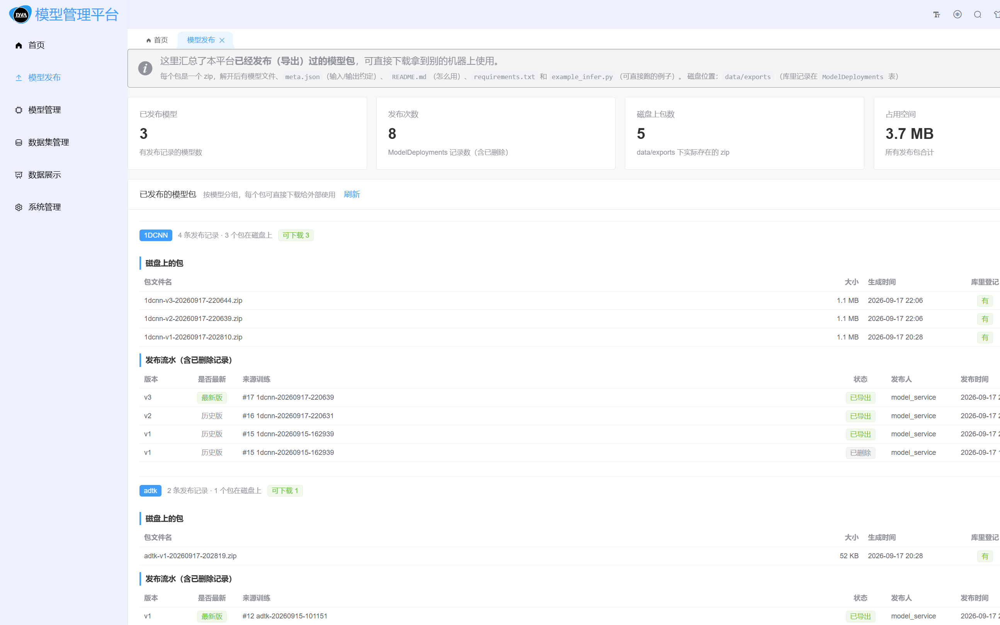

这个页面汇总了**已经发布（导出）过的模型包**，并按模型分组展示，支持直接下载。

页面构成：

| 区域 | 说明 |
|---|---|
| **顶部提示条** | 说明包的用途与磁盘位置（`data/exports`） |
| **KPI 四连** | 已发布模型数、发布包总数等汇总指标 |
| **按模型分组** | 每个模型一个可折叠分组，显示"X 条发布记录 · Y 个包在磁盘上 可下载 Z" |
| **每行一条发布记录** | 显示版本、来源训练、状态、发布人、发布时间，并提供「下载」按钮 |
| **「看内容」按钮** | 下载前先看包里有什么（不解压、不落盘） |

#### 查看包内容

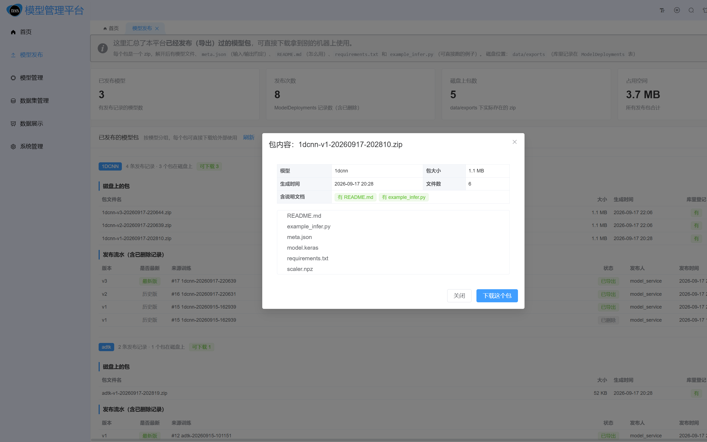

点「看内容」会弹出对话框，**列出 zip 内的目录结构与文件树**，
让使用者在下载前就知道包里有哪些文件，而不是拿到一个文件名就下载。

#### 状态说明

| 状态 | 含义 |
|---|---|
| **已导出** | 包已成功生成、文件在磁盘上，可下载 |
| **已删除** | 历史发布记录保留，但磁盘上的包已被删除（「下载」按钮置灰） |

> **为什么删了包还要保留记录**：包没了，但"曾经发布过 v1"是历史事实。
> 删掉记录会断掉审计链——无法回答"这个版本到底发布过没有"。

#### 关于下载与数据库的关系

页面顶部有一个刻意的设计：**数据库连不上时，依然显示磁盘上实际存在的包**。

> **为什么这样设计**：模型包是交付物，**能不能下载不应该取决于数据库是否健在**。
> 所以「发布包清单」优先从磁盘读，数据库只用来补充"谁发布的、什么时候发布的"这些元信息。
> 数据库故障时会显示一条黄色提示，但下载功能不受影响。

### 4.3 模型管理

模型管理页包含 5 个页签：**模型清单 / 训练 / 推理 / 训练记录 / 推理任务**。

#### 4.3.1 模型清单

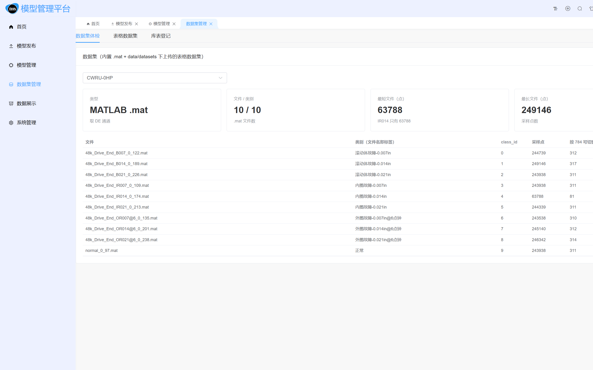

列出所有已登记的模型，每个模型可执行：

| 操作 | 作用 | 所需权限 |
|---|---|---|
| **编辑** | 修改模型名称、描述等元信息 | `model:write` |
| **发布** | 把当前产物打包成可下载的 zip | `export:run` |
| **删除** | 删除模型产物 | `model:delete` |
| **上传模型** | 登记一个已有模型产物 | `model:write` |

#### 4.3.2 训练

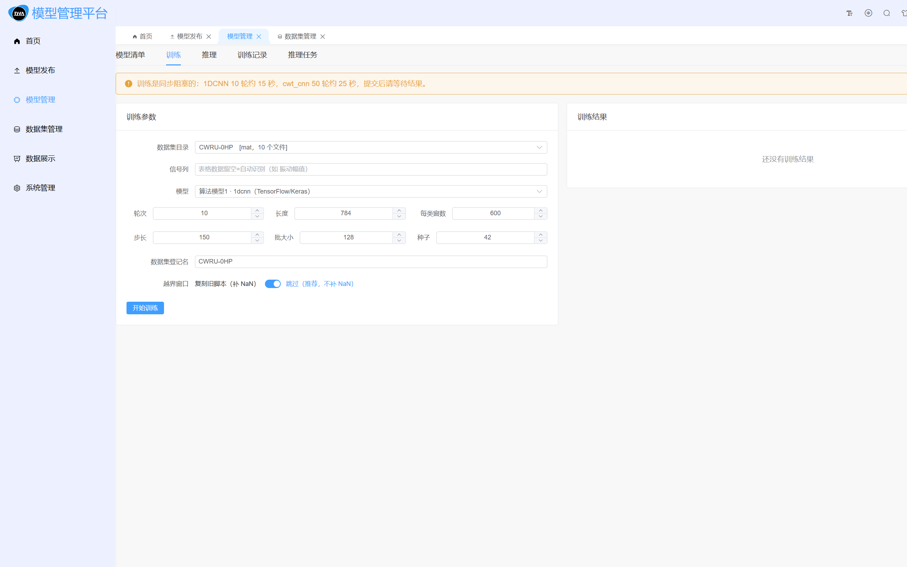

训练参数说明：

| 参数 | 说明 | 默认值 |
|---|---|---|
| **数据集目录** | 选择内置数据集（CWRU-0HP / CWRU-0HP(cwt) / 表格数据集） | CWRU-0HP |
| **信号列** | 表格数据专用；留空 = 自动识别（如"振动幅值"） | 留空 |
| **模型** | 选择算法模型（1dcnn / cwt_cnn / adtk） | 1dcnn |
| **轮次** | 训练轮数 | 10 |
| **长度** | 每个样本窗口长度 | 784 |
| **每类窗数** | 每个类别切出多少窗口 | 600 |
| **步长** | 滑窗步长 | 150 |
| **批大小** | batch size | 128 |
| **种子** | 随机种子，保证可复现 | 42 |
| **数据集登记名** | 写入 `Datasets` 表的名称 | CWRU-0HP |

点击「开始训练」后，训练过程与结果会写入 `Trainings` 表，可在「训练记录」页签查看。

> ⚠️ **训练是同步阻塞的**。HTTP 请求会一直挂到训练结束才返回，
> 因此前端按钮会处于 loading 状态。训练大模型时请耐心等待，不要重复点击。

> ⚠️ **越界窗口会被拒绝，而不是补 NaN**。服务端对越界的切片**直接拒绝并提示越界位置**，
> 不会用 NaN 填充。这是刻意的设计——宁可训练失败，也不要训练出一个用脏数据喂出来的模型。

#### 4.3.3 推理

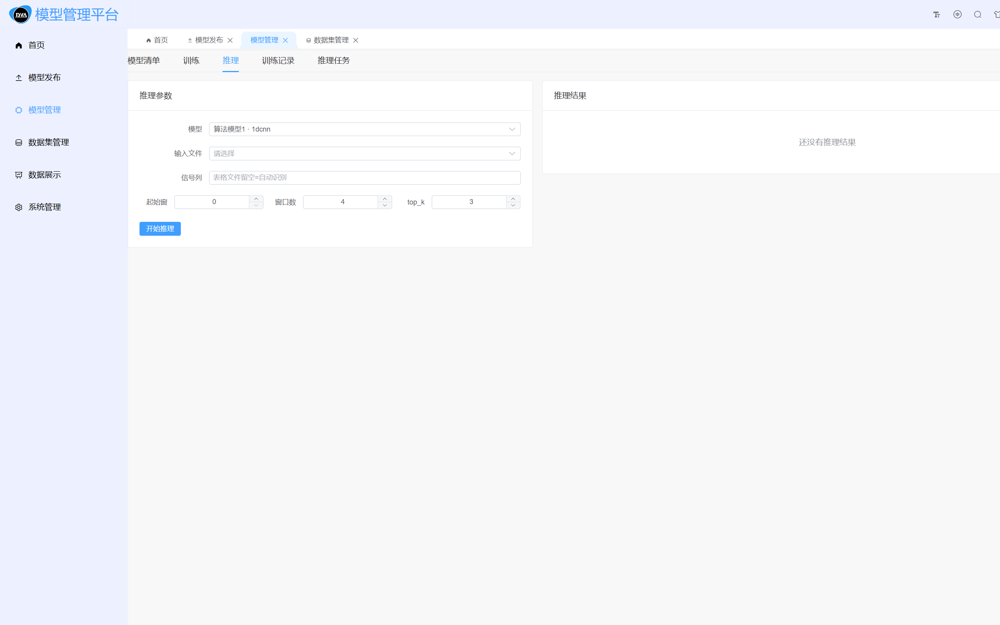

推理参数说明：

| 参数 | 说明 | 默认值 |
|---|---|---|
| **模型** | 选择要使用的模型 | — |
| **输入文件** | 选择数据集中的具体文件 | — |
| **信号列** | 表格文件专用；留空 = 自动识别 | 留空 |
| **起始窗** | 从第几个窗口开始推理 | 0 |
| **窗口数** | 推理多少个窗口 | 4 |
| **top_k** | 返回概率最高的前 k 个类别 | 3 |

推理结果会写入 `InferenceTasks` 与 `InferenceResults` 表，可在「推理任务」页签查看明细。

#### 4.3.4 训练记录 / 推理任务

分别展示历史训练记录与推理任务明细，包括状态、耗时、指标、产物路径等。
**失败的任务同样会留记录**——这是可追溯性的关键。

### 4.4 数据集管理

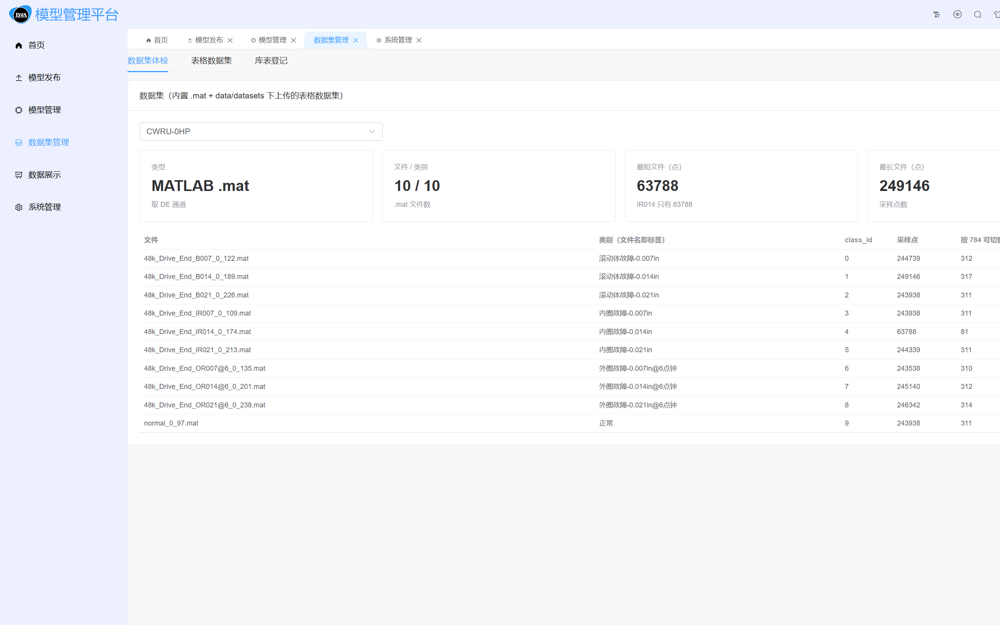

包含 3 个页签：

| 页签 | 作用 |
|---|---|
| **数据集体检** | 检查内置数据集的完整性（文件数、类别、样本量） |
| **表格数据集** | 上传 CSV / Excel 表格数据，指定数据集名与信号列 |
| **库表登记** | 把数据集信息登记到 `Datasets` 表 |

**内置数据集**：

| 名称 | 类型 | 文件数 | 说明 |
|---|---|---|---|
| `CWRU-0HP` | mat | 10 | CWRU 十类轴承故障振动数据 |
| `CWRU-0HP(cwt)` | mat | 10 | 同上，供 cwt_cnn 使用 |
| `表格:DEMO-轴承表格数据` | 表格 | 4 | 演示用的 CSV / Excel 数据 |

**CWRU 数据集的文件名与故障类型对应关系**（内置硬编码表）：

| 文件名 | 故障类型 |
|---|---|
| `normal_0_97.mat` | 正常 |
| `48k_Drive_End_IR007_0_109.mat` | 内圈故障 0.007in |
| `48k_Drive_End_IR014_0_174.mat` | 内圈故障 0.014in |
| `48k_Drive_End_IR021_0_213.mat` | 内圈故障 0.021in |
| `48k_Drive_End_B007_0_122.mat` | 滚动体故障 0.007in |
| `48k_Drive_End_B014_0_189.mat` | 滚动体故障 0.014in |
| `48k_Drive_End_B021_0_226.mat` | 滚动体故障 0.021in |
| `48k_Drive_End_OR007@6_0_135.mat` | 外圈故障 0.007in @6点钟 |
| `48k_Drive_End_OR014@6_0_201.mat` | 外圈故障 0.014in @6点钟 |
| `48k_Drive_End_OR021@6_0_238.mat` | 外圈故障 0.021in @6点钟 |

> **为什么这张表是硬编码的**：CWRU 数据集的文件名是固定的公开数据，
> 文件名本身就编码了故障类型（`IR`=内圈、`B`=滚动体、`OR`=外圈，数字=故障尺寸）。
> 与其让使用者手工标注每个文件属于哪一类（极易标错），不如把这份权威映射写死在代码里。

### 4.5 数据展示

提供信号波形可视化，以及训练/推理过程中自动生成的图：

| 图类型 | 由谁生成 | 说明 |
|---|---|---|
| 信号波形 | 数据展示页 | 原始振动信号时序 |
| 混淆矩阵 | 训练 | 分类模型各类别预测情况 |
| 训练曲线 | 训练 | 准确率/损失随轮次变化 |
| 异常时序 | 推理（adtk） | 无监督异常检测的分数与阈值 |

### 4.6 系统管理

系统管理页包含 5 个页签：**运行信息 / 数据库 / 日志 / 接口索引 / 维护**。

#### 运行信息

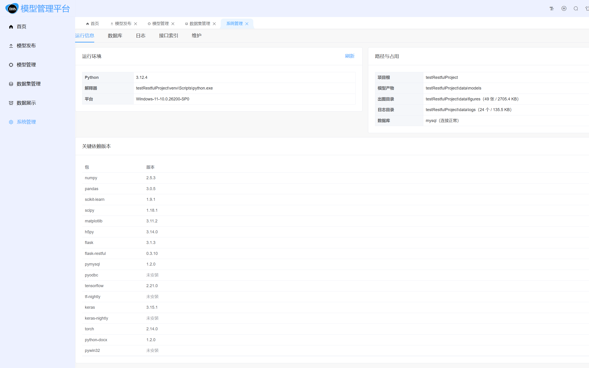

展示服务运行状态、数据库连接状态、连接目标、依赖版本等。

#### 数据库

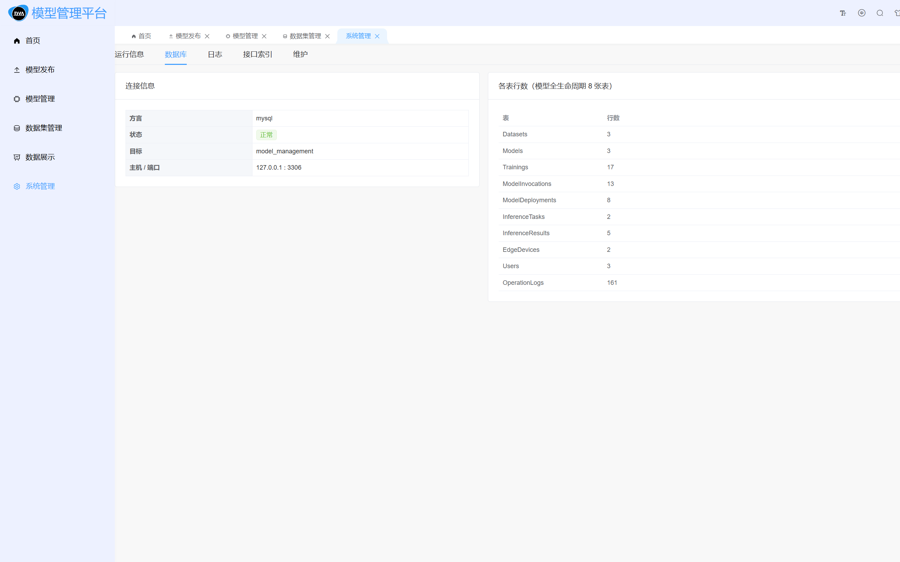

展示 **11 张表**各自的行数：

| 表名 | 用途 |
|---|---|
| `Datasets` | 数据集登记 |
| `Models` | 模型登记 |
| `Trainings` | 训练记录 |
| `ModelInvocations` | 模型调用记录 |
| `ModelDeployments` | 模型发布（导出）记录 |
| `InferenceTasks` | 推理任务 |
| `InferenceResults` | 推理结果明细 |
| `EdgeDevices` | 边缘设备登记 |
| `Roles` | 角色定义 |
| `Users` | 用户账号 |
| `OperationLogs` | 操作审计日志 |

#### 日志

查看后端运行日志（可选尾 100 / 300 / 1000 行）。

#### 接口索引

列出平台所有 HTTP 接口，便于集成方查阅。

#### 维护

提供维护类操作（如重新体检数据集等）。

---

### 4.7 用户管理（管理员专属）

用户管理是**仅管理员可见**的页签，入口在「系统管理 → 用户管理」。
非管理员（工程师 / 操作员）登录后，该菜单项不会出现，直接输入地址也会被路由拦截。

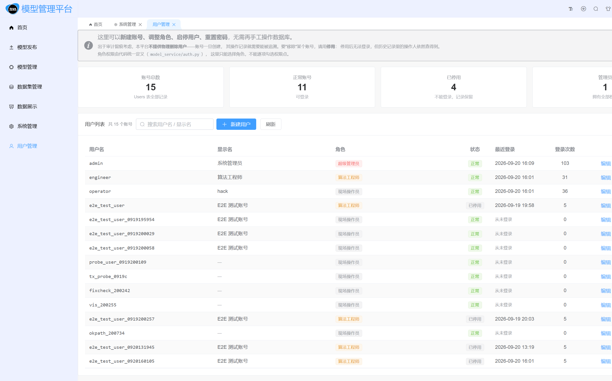

页面结构：

| 区域 | 内容 |
|---|---|
| KPI 卡片 | 账号总数 / 正常账号 / 已停用 / 管理员数量 |
| 搜索区 | 按用户名或显示名搜索 |
| 用户表格 | 用户名 / 显示名 / 角色 / 状态 / 最近登录 / 登录次数 / 操作 |
| 行操作 | 编辑、重置密码、停用（或启用） |

#### 能做什么

| 操作 | 说明 |
|---|---|
| **新建用户** | 填用户名、显示名、密码、角色；密码需满足长度要求 |
| **编辑用户** | 改显示名、角色；用户名不可改（避免审计断链） |
| **重置密码** | 管理员直接设定新密码，**被重置者的当前登录立即失效** |
| **停用 / 启用** | 停用后该账号无法登录，但**记录保留**（不物理删除，保证审计完整性） |

#### 两条关键设计

**① 不做物理删除，只做停用。**
工厂场景下"谁删了模型"必须能追溯。如果允许物理删除用户，那这个用户历史上做过的所有操作就会失去主语，
审计链断裂。所以停用（`IsActive=0`）是正确选择 —— 账号登不进来，但历史记录里的操作人仍然查得到。

**② 管理员不能把自己锁在门外。**
后端对以下操作做了硬校验，前端也同步禁用按钮：

- 不能修改**自己**的角色
- 不能停用**自己**
- 不能停用**最后一个**管理员账号

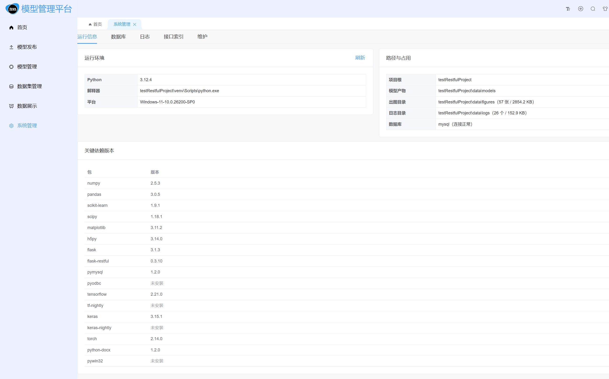

上图是工程师账号登录后的侧边栏 —— 同样进入「系统管理」，但**没有「用户管理」子项**。
这是后端 `_menu_payload()` 按角色过滤菜单的结果，属于服务端控制，不是前端简单隐藏。

#### 三个内置账号

平台首次启动时自动创建，用于演示权限差异：

| 账号 | 口令 | 角色 | 可见范围 |
|---|---|---|---|
| `admin` | `Admin@2026` | 管理员 | 全部功能，含用户管理 |
| `engineer` | `Engineer@2026` | 工程师 | 模型 / 数据集 / 训练 / 推理，无用户管理 |
| `operator` | `Operator@2026` | 操作员 | 只读为主，无用户管理与日志查看 |

> ⚠️ 正式投入使用时请尽快修改这三个账号的口令，或停用演示账号。
> 忘记口令可用 `testRestfulProject/tools/reset-login-accounts.py` 重置。

---

### 4.8 操作日志（管理员专属）

操作日志与用户管理一样，**仅管理员可见**，入口在「系统管理 → 操作日志」。

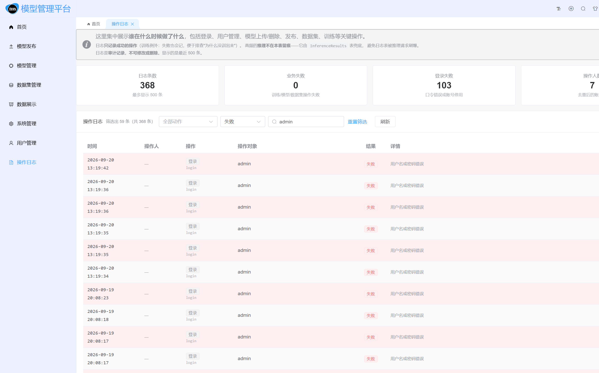

这个页面回答的问题是：**谁、在什么时候、对哪个对象、做了什么、结果如何**。

#### 页面结构

| 区域 | 内容 |
|---|---|
| KPI 卡片 | 日志条数 / 业务失败 / 登录失败 / 操作人数 |
| 筛选栏 | 动作下拉（可选「全部动作」）、结果下拉（成功/失败）、关键字搜索、重置筛选 |
| 日志表格 | 时间 / 操作人 / 操作 / 操作对象 / 结果 / 详情 / 来源 IP |

#### 记录范围

| 分类 | 动作 |
|---|---|
| **鉴权** | 登录、登出、修改密码 |
| **用户管理** | 新建用户、修改用户、重置密码 |
| **模型** | 上传模型、修改模型、删除模型产物、删除模型记录、发布模型、取消发布 |
| **数据集** | 上传数据集、登记数据集 |
| **训练** | 训练（`run_training`） |

#### 四个设计决策

**① 只记录成功操作（训练例外）。**
失败路径不写日志，避免日志被无效尝试刷屏。唯一的例外是**训练**——训练失败也会记录（带失败原因），
因为"为什么没训出来"是现场最需要排查的问题。

**② 推理不记录。**
推理是最高频操作，全量记录会让 `OperationLogs` 迅速膨胀。推理由 `InferenceResults` 表兜底留痕，
验收时问"推理有没有记录"，答案是"在推理结果表里"。

**③ KPI 把「业务失败」和「登录失败」拆开。**
这两类失败的严重性完全不同：

- **登录失败**：口令输错、账号停用 —— 日常噪音，量大是正常的
- **业务失败**：训练、模型、数据集操作出错 —— 这才是真正需要关注的

如果混成一个数字，会出现"失败 103 条"这种吓人的数字，
而实际上业务失败是 0、全部是口令输错。拆开后排查方向才清晰。

**④ 详情字段解析成 key=value 展示。**
`Detail` 列在数据库里是 JSON 字符串（`LONGTEXT`）。页面把它解析成 `key=value` 标签展示，
例如 `already_existed=true`、`old_name=旧名`、`renamed=false`，比看一整行 JSON 好读得多。

> 解析失败时页面**不会崩**——后端刻意不做 JSON 解析（一段坏 JSON 不该让整个日志列表 500），
> 所以坏数据是会流到前端的，前端用 try/catch 兜住，退回显示 `Message` 字段。

#### 筛选说明

筛选与搜索都在**前端**完成，因为后端接口只提供 `?limit=`（上限 500 条），
没有分页与筛选参数。在工厂内网的日志量级下完全够用。

三个筛选项叠加生效，命中范围是：用户名、操作对象、详情、失败原因、来源 IP、动作中文名。

---

## 5. 模型调用方式

平台提供三种调用方式，适用不同场景。三者最终走的是**同一套后端推理代码**，结果一致。

### 5.1 调用链路总览

```
方式一：界面点击
  浏览器 → POST /predict → inference.predict() → 模型产物 → 结果写库 → 页面展示

方式二：HTTP 接口
  curl / Postman → POST /predict（带 Bearer 令牌）→ 同上

方式三：Python 代码
  ① 平台内调用：requests → POST /predict → 同上
  ② 脱离平台：下载发布包 → 直接加载模型文件推理（不需要平台）
```

> **方式三的 ② 是交付的重点**：别人拿到模型包后，**不依赖本平台也能运行**。
> 详见 [第 6 节 模型发布与外部使用](#6-模型发布与外部使用)。

### 5.2 方式一：界面调用

最直观的方式：在「模型管理 → 推理」页签选择模型、输入文件、参数，点「开始推理」。

结果会显示在页面上（各类别概率 + top_k），同时写入数据库，可在「推理任务」页签回看。

### 5.3 方式二：HTTP 接口调用

#### 第一步：获取令牌

```bash
curl -X POST http://127.0.0.1:5000/api/login/ \
  -H "Content-Type: application/json" \
  -d '{"username":"admin","password":"Admin@2026"}'
```

返回：

```json
{
  "code": 2000,
  "msg": "请求成功",
  "data": {
    "access": "<令牌字符串>",
    "user": { "username": "admin", "role_info": [...] }
  }
}
```

#### 第二步：用令牌调用推理接口

```bash
curl -X POST http://127.0.0.1:5000/predict \
  -H "Content-Type: application/json" \
  -H "Authorization: Bearer <令牌字符串>" \
  -d '{
    "model": "1dcnn",
    "path": "CWRU-0HP/normal_0_97.mat",
    "index": 0,
    "limit": 4,
    "top_k": 3
  }'
```

#### 请求字段说明

| 字段 | 必填 | 类型 | 说明 |
|---|---|---|---|
| `model` | ✅ | string | 模型名，如 `1dcnn` / `cwt_cnn` / `adtk` |
| `path` | 二选一 | string | 工作区内文件路径（相对于数据集目录） |
| `samples` | 二选一 | array | 内联样本数组（直接传数据，不读文件） |
| `index` | ❌ | int | 起始窗口序号，从 0 开始，**不能为负**，默认 0 |
| `limit` | ❌ | int | 推理窗口数，默认 1 |
| `top_k` | ❌ | int | 返回前 k 个类别，范围 1..50，默认 3 |
| `training_id` | ❌ | int | 指定用哪次训练的产物；不传则用当前产物 |
| `column` | ❌ | string | 表格文件的信号列名；留空 = 自动识别 |
| `sheet` | ❌ | string | Excel 的工作表名 |
| `write_db` | ❌ | bool | 是否写库留痕，默认 `true` |

#### 响应说明

```json
{
  "predictions": [
    { "index": 0, "top": [ {"label":"正常","prob":0.98}, ... ] }
  ],
  "summary": { ... },
  "figures": [ ... ],
  "db": { "task_id": 12, "written": true }
}
```

失败时返回 `{"error": "..."}` 加合适的 HTTP 状态码，并且（能写库时）把失败原因也写进 `ModelInvocations`。

#### 错误码速查

| HTTP | 含义 | 处理 |
|---|---|---|
| 400 | 参数非法（如 `limit` 超出范围、`index` 为负） | 按 `error` 提示修正参数 |
| 401 | 未登录 / 令牌过期 / 令牌签名不对 | 重新登录获取令牌 |
| 403 | 已登录但**没有该操作权限** | 换有权限的账号，或让管理员授权 |
| 404 | 模型或文件不存在 | 检查 `model` / `path` |
| 500 | 服务端异常 | 查后端日志 |

### 5.4 方式三：Python 代码调用

#### ① 调用平台接口

```python
import requests

BASE = "http://127.0.0.1:5000"

# 1. 登录拿令牌
r = requests.post(f"{BASE}/api/login/",
                  json={"username": "admin", "password": "Admin@2026"})
token = r.json()["data"]["access"]

# 2. 调推理接口
r = requests.post(
    f"{BASE}/predict",
    headers={"Authorization": f"Bearer {token}"},
    json={"model": "1dcnn", "path": "CWRU-0HP/normal_0_97.mat",
          "index": 0, "limit": 4, "top_k": 3},
)
print(r.json())
```

> ⚠️ **注意令牌前缀是 `Bearer `**（带一个空格）。
> 后端同时兼容 `JWT ` 前缀与裸令牌，但**建议统一使用 `Bearer `**（HTTP 标准写法）。

#### ② 脱离平台直接加载模型（推荐给外部使用方）

从「模型发布」页下载 zip 包，解压后：

```bash
pip install -r requirements.txt
python example_infer.py
```

包内 `example_infer.py` 是**复制粘贴就能跑的最小示例**，已按该模型的输入长度、
标签顺序、预处理方式写好。详见下一节。

---

## 6. 模型发布与外部使用

### 6.1 为什么要有这个功能

老师的要求是：**训练好的模型导出成文件，可提供下载，供别人使用**。

如果没有这个功能，模型就"锁"在这台机器的 `data/models/` 目录里——
别人想用，只能把整个项目拷走，还要重新配环境、装依赖。
有了发布功能，交付物变成一个**自包含的 zip 包**：拿到就能用，不依赖本平台。

### 6.2 发布包的内部结构

一个发布包（zip）解开后长这样：

```
1dcnn-v1-20260917-202810/
├── 1dcnn.h5                     ← 模型权重文件（TensorFlow/Keras）
├── scaler.pkl                   ← 标准化器（**必须带，否则输入对不上**）
├── meta.json                    ← 完整元数据（已脱敏）
├── README.md                    ← 把 meta.json 翻译成人话
├── requirements.txt             ← 依赖与**真实版本号**
└── example_infer.py             ← 复制粘贴就能跑的最小示例
```

每个文件的存在理由：

| 文件 | 为什么必须存在 |
|---|---|
| **模型权重** | 模型本体 |
| **`scaler.pkl`** | 训练时对输入做了标准化，推理时**必须用同一个 scaler**，否则输入分布对不上、结果全错。这是最容易被忽略、也最容易导致"包能跑但结果不对"的坑 |
| **`meta.json`** | 输入长度、标签顺序、训练超参、数据集指纹、指标——外部使用方需要的全部约定 |
| **`README.md`** | 把 `meta.json` 翻译成人话：输入多长、标签什么顺序、为什么必须带 scaler |
| **`requirements.txt`** | 依赖与**运行环境里的真实版本**，避免"照着装却装错版本" |
| **`example_infer.py`** | 把"能不能用"从口头说明变成**可执行验证** |

> **关于 `meta.json` 的脱敏**：包中**重新生成**一份 `meta.json`，
> 而非直接复制磁盘上的原文件，会把 `dataset.path`、`dataset.stats.baseline_source`、
> `log_file` 这类**本机绝对路径**抹除。原因：这些路径暴露了服务器的目录结构，
> 对使用方无用，属于不应外流的信息。

### 6.3 如何发布一个模型

**前置条件**：该模型已有训练好的产物（`data/models/<模型名>/` 下有文件）。

1. 进入「模型管理 → 模型清单」
2. 找到目标模型，点「**发布**」
3. 在弹窗中确认版本号（系统会自动递增，如 `v1` → `v2`）
4. 点击发布，等待打包完成
5. 到「**模型发布**」页面即可看到新包，点「下载」取走

发布记录会写入 `ModelDeployments` 表，包含版本、发布人、发布时间、来源训练 ID。

### 6.4 外部使用方怎么用这个包

```bash
# 1. 解压
unzip 1dcnn-v1-20260917-202810.zip
cd 1dcnn-v1-20260917-202810

# 2. 装依赖
pip install -r requirements.txt

# 3. 跑示例（验证环境是否 OK）
python example_infer.py
```

若示例能跑通，说明环境就绪；之后参照 `example_infer.py` 接入自己的代码即可。

### 6.5 关于 PyTorch 模型（`cwt_cnn`）的特别说明

`cwt_cnn` 是 PyTorch 模型。PyTorch 保存方式有两种：

| 方式 | 含义 | 外部使用是否方便 |
|---|---|---|
| `state_dict` | 只保存参数张量 | ❌ 需要知道模型类定义才能加载 |
| 完整模型 | 保存网络结构 + 参数 | ✅ 可直接加载 |

发布包中 PyTorch 模型按项目当前的保存方式导出。
`README.md` 与 `example_infer.py` 会写明**该包实际的加载方式**，请以包内说明为准。

> **给外部使用方的建议**：拿到 PyTorch 模型包时，先读 `README.md`，
> 再跑 `example_infer.py`。如果示例需要额外的模型定义文件，包里会一并说明。

---

## 7. 权限体系说明

### 7.1 三级角色

| 角色 | 中文名 | 能做什么 |
|---|---|---|
| `admin` | 超级管理员 | **全部权限**，含用户管理、查看操作日志 |
| `engineer` | 算法工程师 | 看模型、登记/改模型、删除模型、发起训练、发起推理、发布/删除发布包、上传数据集 |
| `operator` | 现场操作员 | **只能看**和**跑推理** |

### 7.2 权限点与角色对照表

| 权限点 | 中文名 | admin | engineer | operator |
|---|---|:---:|:---:|:---:|
| `model:read` | 查看模型与产物 | ✅ | ✅ | ✅ |
| `model:write` | 登记/修改模型 | ✅ | ✅ | ❌ |
| `model:delete` | 删除模型（含产物） | ✅ | ✅ | ❌ |
| `train:run` | 发起训练 | ✅ | ✅ | ❌ |
| `predict:run` | 发起推理 | ✅ | ✅ | ✅ |
| `export:run` | 发布/导出模型包 | ✅ | ✅ | ❌ |
| `export:delete` | 删除发布包 | ✅ | ✅ | ❌ |
| `dataset:write` | 上传/登记数据集 | ✅ | ✅ | ❌ |
| `user:manage` | 管理用户与角色 | ✅ | ❌ | ❌ |
| `log:read` | 查看操作日志 | ✅ | ❌ | ❌ |

> **下载发布包需要什么权限？** 只需要**登录**（`require_login`），不需要 `export:run`。
> 理由：浏览和取用别人做好的模型包是**读**操作，现场操作员也该能下载。

### 7.3 修改密码

登录后通过右上角用户菜单进入修改密码。修改密码会**递增 `TokenVersion`**，
使该用户所有旧令牌**立即失效**——这是刻意的安全设计：改了密码就该把旧会话踢掉。

### 7.4 权限控制的两个层次

| 层次 | 位置 | 作用 |
|---|---|---|
| **前端隐藏** | Vue 页面根据 `permissions` 决定按钮显隐 | 提升体验，让没权限的人不看到无效按钮 |
| **后端强鉴权** | 每个接口上的 `@require_perm(...)` | **真正的拦截** |

> ⚠️ **只靠前端隐藏按钮是不够的**：绕过前端直接调用接口就会失效。
> 因此后端每个敏感接口都独立校验权限，前端隐藏仅起"友好提示"的作用。

### 7.5 角色权限定义在哪里

**权限的唯一定义处**是代码，不是数据库表：

```python
# testRestfulProject/model_service/auth.py
PERM_LABELS = {
    "model:read": "查看模型与产物",
    "model:write": "登记/修改模型",
    "model:delete": "删除模型（含产物）",
    "train:run": "发起训练",
    "predict:run": "发起推理",
    "export:run": "发布/导出模型包",
    "export:delete": "删除发布包",
    "dataset:write": "上传/登记数据集",
    "user:manage": "管理用户与角色",
    "log:read": "查看操作日志",
}
```

> **为什么权限写死在代码里**：把"这个角色到底能干什么"变得一眼可见、可 review、可版本管理，
> 而不是散落在数据库里、只能查库才能回答。数据库的 `Roles` 表只存角色的**显示名**。
>
> **未知角色返回空权限集，而不是全部权限**——这是刻意的失败方向：
> 如果哪天数据库里出现一个拼错的 `RoleKey`，宁可让人登进去什么都干不了、
> 立刻发现异常，也不要因为兜底给全权限而**悄悄提权**。

---

## 8. 部署与运维

> ⚠️ 本章路径与端口按**实验室交付主机**填写（项目在 `D:\offline_package\04-program-code\`，
> 服务名 `ModelManageService`，端口 **5000**）。

### 8.1 生产启动

```powershell
cd D:\offline_package\04-program-code\testRestfulProject
venv\Scripts\python.exe serve.py --host 0.0.0.0 --port 5000 --threads 4
```

`serve.py` 用 **waitress**（纯 Python 的 WSGI 服务器）：

| 特性 | 说明 |
|---|---|
| **不开调试模式** | 生产环境绝不能开 `debug=True`——它允许远程执行代码 |
| **零额外依赖** | 纯 Python 实现，Windows 上不需要编译 |
| **Windows 友好** | 相比 gunicorn（不支持 Windows），waitress 是 Windows 上的标准选择 |
| **隐藏版本号** | `ident` 改成中性值，避免响应头暴露 `waitress` 与版本号 |

### 8.2 服务化（开机自启 + 崩溃重启）

用 **NSSM**（免费单文件工具，无需安装）把服务注册成 Windows 服务。

**实验室主机上已注册的服务**：

| 项 | 实验室主机的实际值 |
|---|---|
| **服务名** | **`ModelManageService`** |
| 可执行 | `D:\offline_package\04-program-code\testRestfulProject\venv\Scripts\python.exe` |
| 启动目录 | `D:\offline_package\04-program-code\testRestfulProject` |
| 参数 | `serve.py --host 0.0.0.0 --port 5000 --threads 4` |
| 启动类型 | **自动**（开机自启） |
| 崩溃恢复 | 自动重启，延迟 15 秒 |
| 日志 | 输出到 `service-out.log` / `service-err.log` |

> ⚠️ **服务名必须是 `ModelManageService`**。仓库里的安装脚本
> （`docs\离线部署\部署脚本\05-install-service.ps1`）默认用的是 `ModelPlatform`，
> 与实验室主机上已注册的服务名**不一致**。
> **不要重新跑那个脚本** —— 它会注册出一个**第二个服务**，
> 两个服务抢同一个端口 5000，后启动的会失败，排查起来很费劲。
>
> 想知道本机到底注册了什么名字，用：
> ```powershell
> Get-Service | Where-Object { $_.Name -match "Model" } | Format-Table Name, Status, StartType
> ```

**常用命令（必须用管理员身份）**：

```powershell
net start ModelManageService             # 启动
net stop  ModelManageService             # 停止
Restart-Service ModelManageService       # 重启
sc query  ModelManageService             # 查状态
```

> ⚠️ **`net stop/start` 报「系统错误 5，拒绝访问」怎么办**：
> 这是**权限不足**，不是服务有问题。普通用户身份的 CMD 无法操作 Windows 服务。
> 解决：**右键开始菜单 → 终端（管理员）/ CMD（管理员）**，再执行上面的命令。

### 8.3 防火墙

让局域网内其他机器能访问，需要放行 **5000**：

```powershell
# 需管理员权限
New-NetFirewallRule -DisplayName "模型管理平台" -Direction Inbound `
  -Protocol TCP -LocalPort 5000 -Action Allow
```

之后局域网内用 `http://<本机IP>:5000` 访问。

### 8.4 MySQL 开机自启

> ⚠️ **这一项必须确认**。否则会出现一个很有迷惑性的现象：
> **网页打得开（后端服务在跑），但一登录就报错**——因为后端连不上数据库。

**现象**：重启电脑后，浏览器能打开登录页，但登录提示失败或报数据库错误。

**原因**：MySQL 服务未设置开机自启；电脑重启后 MySQL 没有自己起来。

**检查与解决**（管理员 PowerShell）：

```powershell
# 查看状态与启动类型
Get-Service -Name MySQL80 | Format-Table Name, Status, StartType

# 设为开机自启
Set-Service -Name MySQL80 -StartupType Automatic

# 如果现在没跑，立即启动
Start-Service -Name MySQL80
```

> ⚠️ 服务名不一定是 `MySQL80`。用 `Get-Service | Where-Object { $_.Name -match "MySQL" }`
> 确认本机实际名字（也可能是 `MySQL` 或 `MySQL80`）。
>
> ⚠️ 若 `Start-Service` 报权限错误，用**管理员**终端重试。

### 8.5 数据备份

> **当前状态说明**：备份是**通过 Windows 任务计划程序 + 批处理脚本**在主机上实现的运维措施，
> **不是平台内置功能**（代码里没有备份模块）。因此备份脚本存放在部署机器上，
> 不在代码仓库中。

**实验室主机的备份方案**：

| 项 | 实际值 |
|---|---|
| 方式 | Windows 任务计划程序 + `backup_daily.bat` |
| 时间 | 每日 **02:00** |
| 备份目录 | `D:\Backup\ModelManage\`（按日期分文件夹） |
| 保留 | 7 天 |

**备份内容**：

| 内容 | 说明 |
|---|---|
| MySQL 全库 SQL | `mysqldump` 导出 `model_management` |
| `data/` 目录 | 数据集、模型产物、生成的图、发布包 |
| `db.env` | 数据库连接与密钥配置 |

**备份脚本模板**：

```bat
@echo off
setlocal

:: ===================== 配置区：按实际环境修改 =====================
set MYSQL_BIN="C:\Program Files\MySQL\MySQL Server 8.0\bin\mysqldump.exe"
set DB_USER=root
set DB_PASS=<数据库密码>
set DB_NAME=model_management
set PROJECT_DIR="D:\offline_package\04-program-code\testRestfulProject"
set BACKUP_ROOT="D:\Backup\ModelManage"
set KEEP_DAYS=7
:: =================================================================

:: 生成当天日期文件夹
set BACKUP_DATE=%date:~0,4%%date:~5,2%%date:~8,2%
set BACKUP_DIR=%BACKUP_ROOT%\%BACKUP_DATE%
if not exist %BACKUP_DIR% mkdir %BACKUP_DIR%

:: 1. 备份 MySQL 数据库
%MYSQL_BIN% -u%DB_USER% -p%DB_PASS% %DB_NAME% > %BACKUP_DIR%\%DB_NAME%_%BACKUP_DATE%.sql

:: 2. 备份项目业务文件
xcopy /e /h /y %PROJECT_DIR%\data %BACKUP_DIR%\project_data\
xcopy /e /h /y %PROJECT_DIR%\db.env %BACKUP_DIR%\

:: 3. 清理 N 天前的旧备份
forfiles /p %BACKUP_ROOT% /m *.* /d -%KEEP_DAYS% /c "cmd /c rd /s /q @path" 2>nul

endlocal
```

> ⚠️ **配置时两个常见问题**：
>
> 1. **文件存成了 `.txt`**：Windows 默认隐藏已知扩展名，在记事本中"另存为
>    `backup_daily.bat`"实际得到的是 `backup_daily.bat.txt`，双击不会执行。
>    解决：在资源管理器"查看"中勾选**"文件扩展名"**，再重命名去掉 `.txt`。
> 2. **创建计划任务时要求输入密码却创建失败**：若主机账号无开机密码，
>    Windows 安全策略会禁止其后台运行计划任务。
>    解决：`secpol.msc` → 本地策略 → 安全选项 → 将
>    **"账户：使用空密码的本地账户只允许进行控制台登录"** 设为**已禁用**，
>    之后密码留空即可创建成功。

**验证备份是否成功**：备份目录下应出现当天日期文件夹，内含 SQL 文件（**大小不为 0**）、
业务文件目录、`db.env`。

**恢复方法**：

```powershell
& "C:\Program Files\MySQL\MySQL Server 8.0\bin\mysql.exe" -u root -p model_management `
  -e "source D:\Backup\ModelManage\20260920\model_management_20260920.sql"
```

### 8.6 部署清单速查

| 项目 | 内容 |
|---|---|
| Windows 服务 | `ModelManageService`（NSSM 注册，开机自启 + 崩溃重启） |
| 项目根目录 | `D:\offline_package\04-program-code\testRestfulProject` |
| 计划任务 | 每日 02:00 备份 |
| 备份目录 | `D:\Backup\ModelManage\`（按日期分文件夹，保留 7 天） |
| 数据库 | `model_management`（MySQL 8.0，程序在 `C:\Program Files\MySQL\MySQL Server 8.0\bin\`） |
| 日志表 | `OperationLogs`（主键 `LogID`） |
| 关键文件 | `serve.py`、`db.env`、`venv\Scripts\python.exe` |
| 访问地址 | `http://<本机IP>:5000` |

### 8.7 交付前自查清单

正式交付/验收前，逐项确认：

1. ☐ **修改三个默认账号的密码**（`admin` / `engineer` / `operator`）
2. ☐ **`db.env` 中的 `MODEL_SECRET_KEY` 已配置**（否则重启掉线）
3. ☐ **MySQL 已设为开机自启**（见 §8.4），并且**重启一次电脑验证**
4. ☐ **服务已注册为开机自启**，重启后无需手工启动即可访问
5. ☐ **备份计划任务已跑过一次成功**，备份目录里有完整内容
6. ☐ **安装 VC++ 运行库**（若目标机器尚未安装；TensorFlow 依赖它）
7. ☐ **浏览器按 `Ctrl+F5` 强刷**，确认看到的是最新页面（见 §10.8）
8. ☐ **数据库快照归档**：把当前稳定的库结构导出一份留底
## 9. 常见问题排查

### 9.1 登录不了 / 一直提示密码错误

按以下顺序排查：

| 步骤 | 检查项 | 说明 |
|---|---|---|
| 1 | **确认账号密码** | `admin` 的密码是 `Admin@2026`，**不是** `123456` |
| 2 | **按 `Ctrl + F5` 强制刷新** | 浏览器可能缓存了旧版前端 js |
| 3 | **确认前端是最新版** | 旧版前端会对密码做 MD5，与后端 `pbkdf2` 不匹配 |
| 4 | **用脚本重置账号** | 见下方说明 |

**关于密码哈希被人手工改坏**：

`werkzeug` 的 `check_password_hash` 对哈希串格式**非常敏感**——
首尾多一个空格、少一个 `$` 分隔符，都会导致校验失败，而且**不报错，只是登不进去**。
因此**不要手工往数据库里插密码哈希**，请用脚本：

```powershell
cd D:\offline_package\04-program-code\testRestfulProject
venv\Scripts\python.exe tools\reset-login-accounts.py --help
```

> 💡 这个脚本的源文件位于 `testRestfulProject\tools\reset-login-accounts.py`。
> 若部署机器上没有该脚本，从安装包中复制一份即可，它是**独立脚本**、不依赖其他改动。

该脚本会：
- 诊断现有密码哈希是否"健康"
- 按正确算法重新生成哈希并更新数据库
- 同时递增 `TokenVersion`（踢掉旧令牌）

> **为什么手工改库不管用**：`db.bootstrap_users()` 在**首次启动时**会自动创建/校正种子账号，
> 但它有一个判断：`if self.count_users() > 0: return 0` —— 即**只要 `Users` 表中已有数据，就跳过**。
> 因此一旦手工插入了错误的哈希，后续重启**不会**自动修正，必须用脚本显式重置。

### 9.2 重启服务后所有用户掉线

**现象**：重启后端后，原本已登录的用户全部被踢出，需要重新登录。

**原因**：`db.env` 里没有配置 `MODEL_SECRET_KEY`，后端每次启动随机生成密钥，
导致旧令牌的签名对不上。

**解决**：在 `db.env` 中配置固定的密钥：

```ini
MODEL_SECRET_KEY=<64 位十六进制随机串>
```

生成方法：

```powershell
python -c "import secrets; print(secrets.token_hex(32))"
```

**验证**：访问 `/health`，`auth.key_is_default` 为 `false` 即表示已生效。

### 9.3 训练或推理报 500 错误

`POST /predict` 或 `POST /train` 返回 500，说明后端处理时抛了异常。

**排查步骤**：

1. **看后端控制台/日志**：异常堆栈会打印出来，这是最直接的线索
2. **常见原因**：

| 原因 | 表现 | 解决 |
|---|---|---|
| **中文文件名** | 读取文件时编码错误 | 把数据文件名改成英文 |
| **缺少 VC++ 运行库** | 导入 TensorFlow 时崩溃 | 安装 Microsoft Visual C++ Redistributable |
| **模型依赖未安装** | `ModuleNotFoundError` | 在 venv 里装齐依赖 |
| **数据越界** | 提示窗口越界 | 调小「窗口数」或改「起始窗」 |
| **输入长度不匹配** | 形状错误 | 确认「长度」与模型训练时一致 |

> **关于 VC++ 运行库**：TensorFlow / PyTorch 在 Windows 上依赖
> **Microsoft Visual C++ Redistributable**。如果离线安装的机器缺这个组件，
> 导入 TensorFlow 时可能直接崩溃（而不是给出清晰的报错）。
> 建议在所有部署机器上预先安装 **VC++ 2015-2022 x64** 运行库。

### 9.4 访问 5000 打不开

| 检查项 | 命令 / 方法 |
|---|---|
| 服务是否在跑 | `Get-Service ModelManageService` |
| 端口是否被监听 | `Get-NetTCPConnection -State Listen -LocalPort 5000` |
| 健康检查 | 浏览器访问 `http://127.0.0.1:5000/health` |
| 防火墙（仅局域网访问需要） | 确认 5000 已放行 |

**按顺序排查**：

```powershell
# 1. 服务状态（应为 Running）
Get-Service ModelManageService | Format-Table Name, Status, StartType

# 2. 端口有没有人在听
Get-NetTCPConnection -State Listen -LocalPort 5000 -ErrorAction SilentlyContinue

# 3. 健康检查（数据库连不上时这里会明确报出来）
Invoke-RestMethod http://127.0.0.1:5000/health | ConvertTo-Json -Depth 5
```

**如果服务没起来**：先看日志文件 `service-err.log`（在项目根目录），
再尝试手动前台启动，这样报错会直接打在屏幕上、看得最清楚：

```powershell
cd D:\offline_package\04-program-code\testRestfulProject
venv\Scripts\python.exe serve.py --port 5000
```

**如果服务没起来**：先查看日志文件 `service-err.log`（位于项目根目录），
再尝试前台手动启动，这样报错会直接显示在屏幕上：

```powershell
cd D:\offline_package\04-program-code\testRestfulProject
venv\Scripts\python.exe serve.py --port 5000
```

> ⚠️ **端口被占用**是常见原因之一，请注意一个容易混淆的情形：
> **Vite 开发服务器（`npm run dev`）与 `serve.py` 的默认端口都是 8080**，
> 两者会冲突。若以不带 `--port` 的方式启动了 `serve.py`，
> 它实际监听的是 8080，而**不是**平台所用的 5000，
> 表现为"服务明明在运行，但 5000 打不开"。
>
> **确认方法**：换一个端口启动，看能否访问
> ```powershell
> venv\Scripts\python.exe serve.py --port 8099
> ```
> 8099 可访问而 5000 不可访问，说明 5000 端口被其他程序占用，或平台服务未启动。

### 9.5 页面能打开但接口全 404

**现象**：前端页面正常显示，但所有数据加载失败，浏览器控制台看到 `/api/api/...` 这样的**双 `/api` 前缀**。

**原因**：`VITE_API_URL` 被设成了 `'/api'`，与接口定义里已有的 `/api` 拼接成了双前缀。

**解决**：把 `.env.singleport` 里的 `VITE_API_URL` 设为**空字符串**，
然后重新构建前端：

```powershell
cd frontend\22project
npm run build:singleport
```

### 9.6 运行环境参数对照

本文以**实验室交付主机**为准。若在其他机器上部署，只需按下表替换**路径与端口**，
功能与操作步骤**完全一致**：

| 项目 | **实验室交付主机**（本文基准） | 其他环境（参考） |
|---|---|---|
| **项目根目录** | `D:\offline_package\04-program-code\testRestfulProject` | 按实际部署位置 |
| **前端源码** | `D:\offline_package\04-program-code\frontend\22project` | 按实际部署位置 |
| **服务名** | `ModelManageService` | 未注册服务时手动启动 |
| **端口** | **5000** | `serve.py` 默认 8080 |
| **MySQL 程序** | `C:\Program Files\MySQL\MySQL Server 8.0\bin\` | 按实际安装位置 |
| **启动方式** | NSSM 服务自启 + 手动 `serve.py --port 5000` | `serve.py` |

> **关于端口**：`serve.py` 的**默认端口是 8080**，而本平台在实验室主机上
> 按 **5000** 部署（服务名 `ModelManageService` 与端口 5000 配套）。
> 本平台以 **5000** 为准。
>
> ⚠️ 因此有两条**必须遵守**的操作约定：
>
> 1. **手动启动必须显式指定 `--port 5000`**，否则会监听 8080，与平台地址不一致。
> 2. **不要重复运行服务安装脚本** `05-install-service.ps1` —— 它按服务名
>    `ModelPlatform` + 端口 8080 注册，会产生一个**额外的服务**并与现有服务抢占端口。

**确认本机实际情况**：

```powershell
Get-Service | Where-Object { $_.Name -match "Model" } | Format-Table Name, Status, StartType
Get-NetTCPConnection -State Listen -LocalPort 5000 -ErrorAction SilentlyContinue
```

> **如果哪天想把两套统一**（可选，不是必须）：推荐把服务重装成与脚本一致的
> `ModelPlatform` + 8080。步骤是：停旧服务 → `nssm remove ModelManageService confirm`
> → 跑 `05-install-service.ps1` → 放行 8080 → 更新本文所有地址。
> **交付验收前不建议动**——现状是稳定可用的。

### 9.7 更新代码到离线机器

离线机器没法直接 `git pull`，需要用**更新包**方式：

```
有网络的机器（更新包来源）        离线机器（目标）
─────────────────────           ────────────
改代码
   ↓
生成更新包（只含改动文件）
   ↓
U 盘拷贝  ──────────────────────▶  运行「应用更新.ps1」
                                        ↓
                                  重启服务
                                        ↓
                                  Ctrl+F5 刷新浏览器
```

相关脚本位于 `docs/离线部署/部署脚本/`，详细流程见 `docs/离线部署/代码更新流程.md`。

> ⚠️ **更新包已包含前端 `dist`**：因此离线机器**不需要安装 Node.js、不需要重新构建**，
> 直接覆盖即可。

> 💡 **更新包中的 PowerShell 脚本为 UTF-8 with BOM 编码**，可直接运行。
> 若自行编写或修改 `.ps1` 脚本，请保持该编码，否则可能报语法错误（见 §9.11）。

### 9.8 操作日志相关

**查询最近登录记录**：

```sql
SELECT LogID, Username, Action, CreatedDate, ClientIP
FROM OperationLogs
ORDER BY LogID DESC
LIMIT 10;
```

> 💡 `OperationLogs` 的**主键字段名是 `LogID`**（不是 `id`），自定义查询时请注意。

**当前记了哪些操作**（`Action` 值全部为 snake_case，与后端 `log_operation()` 一致）：

| 分类 | Action | 触发时机 |
|---|---|---|
| **鉴权** | `login` | 登录（**成功和失败都记**） |
| | `logout` | 登出 |
| | `change_password` | 修改密码 |
| **用户管理** | `create_user` / `update_user` / `reset_password` | 新建/修改用户、重置密码 |
| **模型** | `upload_model` | 上传模型（**覆盖上传时 Detail 记 `replaced`**） |
| | `update_model` | 修改模型信息或改名（Detail 记 `old_name` / `renamed`） |
| | `delete_model` | 删除模型**产物文件** |
| | `delete_model_record` | 删除模型**登记记录** |
| | `publish_model` | 发布模型（打包导出） |
| | `unpublish_model` | 取消发布（删除发布包） |
| **数据集** | `upload_dataset` | 上传数据集文件 |
| | `register_dataset` | 登记数据集（Detail 记 `already_existed`） |
| **训练** | `run_training` | 发起训练（**成功与失败都记**，失败带原因） |

**关于两条刻意的例外**：

- **推理不记** `OperationLogs`：推理是最高频操作，全量记录会让日志表迅速膨胀。
  它由 `InferenceTasks` / `InferenceResults` 业务表兜底留痕。
- **失败路径一般不记**：避免日志被无效尝试刷屏；例外是 `login`（含失败，用于发现暴力尝试）
  与 `run_training`（含失败，用于排查"为什么没训出来"）。

日志的页面化查询见 [§4.8 操作日志](#48-操作日志管理员专属)。

### 9.9 页面中文显示为乱码

**现象**：角色名、模型说明、模型状态等中文字段在页面上显示为乱码，
例如 `超级管理员` 变成 `鋆板洏鏽嶃籛毀` 这样的方块字。

**原因**：数据库中的中文字段编码异常。
**注意：这是数据在写入时就已经存错**，不是页面显示层的问题——
因此改前端无法解决，必须修正数据库中的数据。

**解决**：先切换控制台编码，再以 `utf8mb4` 字符集连接数据库，然后修正中文字段。

```powershell
chcp 65001
& "C:\Program Files\MySQL\MySQL Server 8.0\bin\mysql.exe" `
  -uroot -p --default-character-set=utf8mb4 model_management -e @"
UPDATE Roles SET RoleName='超级管理员' WHERE RoleKey='admin';
UPDATE Roles SET RoleName='工程师'     WHERE RoleKey='engineer';
UPDATE Roles SET RoleName='操作员'     WHERE RoleKey='operator';
"@
```

> ⚠️ **两个关键点，都不能省**：
> 1. **`chcp 65001`** —— 把控制台切到 UTF-8，否则命令中的中文
>    在传给 `mysql.exe` 之前就已经变成乱码。
> 2. **`--default-character-set=utf8mb4`** —— 否则连接按默认字符集协商，修正后仍是乱码。

> 💡 同样的方法可修正其他表的中文字段（如 `Models` 表的说明、状态），
> 把上面的 `UPDATE` 换成对应的表与列即可。

### 9.10 PowerShell 脚本无法运行（执行策略）

**现象**：双击或直接运行 `.ps1` 脚本，报错
「无法加载文件 ...，因为在此系统上禁止运行脚本」。

**原因**：Windows 默认的 PowerShell 执行策略是 `Restricted`，禁止运行任何脚本。

**解决**：用 `-ExecutionPolicy Bypass` 绕过（**只对本次调用生效**，不改系统设置）：

```powershell
powershell -ExecutionPolicy Bypass -File .\应用更新.ps1
```

> ⚠️ 这个参数**只影响这一次运行**，不会降低系统的整体安全性，
> 是运行部署脚本的推荐方式。不要用 `Set-ExecutionPolicy Unrestricted` 去永久放开，
> 那会降低整机的安全性。

### 9.11 更新脚本报语法错误 / 中文乱码

**现象**：运行 `.ps1` 脚本时报语法错误（常见的是"大括号不配对"），
或屏幕上的中文显示为乱码。

**原因**：脚本文件为 **UTF-8 无 BOM** 编码，而 Windows PowerShell 5.1
（即"右键 → 使用 PowerShell 运行"调起的版本）读取无 BOM 文件时，
会按系统 ANSI 代码页（中文系统为 GBK）解析，导致中文内容被错误解码，
其中的字节被当作语法符号，从而报出语法错误。

**解决**：

- **更新包中的脚本已统一为 UTF-8 with BOM**，正常使用不会遇到此问题。
- **临时绕过**：不运行脚本，改为手动复制文件更新（注意不要遗漏 `sql/` 目录，
  见 §9.7）。
- **自查方法**：用 VS Code 打开脚本，右下角应显示 `UTF-8 with BOM`；
  若仅显示 `UTF-8`，用"以编码保存"改为带 BOM 即可。

> 💡 **判断技巧**：若脚本内容看起来完全正常却报语法错误，
> 基本可确定是编码问题——记事本与 VS Code 按 UTF-8 解析，而 PowerShell 5.1 会解错。

### 9.12 更新后浏览器看不到新页面

**现象**：已经更新了代码、也重启了服务，但浏览器里还是旧界面、看不到新功能。

**原因**：浏览器缓存了旧的 JS/CSS 文件。前端打包后的文件名带哈希
（如 `index.B7c-Dewk.js`），但 `index.html` 本身可能被缓存，
导致它仍指向旧的那批资源。

**解决**：**按 `Ctrl + F5` 强制刷新**（会跳过缓存重新拉取）。

若仍不行，用无痕窗口验证一次：

```
Ctrl + Shift + N   （Chrome / Edge 无痕窗口）
```

无痕窗口里能看到新页面，就确认是缓存问题。

> ⚠️ **确认服务真的重启过**：只覆盖文件、没重启服务的话，后端还在跑旧代码。
> 用 `Restart-Service ModelManageService`（管理员）重启。

---

## 10. 当前能力边界与遗留事项

本章**如实说明**系统当前**已具备**和**尚不具备**的能力，避免交付时产生预期偏差。

### 10.1 已具备并验证过的能力

| 能力 | 状态 | 验证方式 |
|---|---|---|
| 三级角色权限控制 | ✅ 已实现 | 后端接口强鉴权 + 前端按钮隐藏 |
| JWT 令牌 + 固定签名密钥 | ✅ 已实现 | 重启服务不掉线 |
| 密码哈希存储（pbkdf2:sha256） | ✅ 已实现 | 数据库不存明文 |
| 操作日志落库 | ✅ 已实现 | 登录/登出/改密/用户管理/删除/发布 |
| 模型发布与下载 | ✅ 已实现 | zip 包 + 路径穿越防护 |
| 单端口部署（前端由后端托管） | ✅ 已实现 | 只暴露一个端口（实验室主机为 5000） |
| 服务化（开机自启 + 崩溃重启） | ✅ 已实现 | NSSM |
| 数据自动备份 | ✅ 已实现 | **主机层面**（计划任务），非平台功能 |

### 10.2 尚不具备的能力（遗留事项）
| 事项 | 现状 | 影响 | 建议 |
|---|---|---|---|
| **边缘端真实接入** | 仅有设计方案（见《边缘端接入设计方案》），`EdgeDevices` 只有 1 行 `local` 占位设备 | 模型无法真正下发到产线设备 | 见该文档 §7 的三阶段实施步骤 |
| **边缘端模型格式转换** | 发布的是 `.keras`，需目标机有 TensorFlow | 低功耗工控机跑不起来 | 转 ONNX / TFLite，见该文档 §6 |
| **账号安全策略** | 无强制改密、无复杂度校验、无登录错误锁定 | 弱密码风险 | 正式投用前建议补 |
| **系统健康监控页面** | 无 | 无法页面查看运行时长/磁盘等 | 可选 |
| **HTTPS** | 未配置 | 密码为明文传输（依赖内网） | 若跨网络使用建议配 HTTPS |
| **服务端分页** | 用户列表、操作日志均为一次性取回（日志上限 500 条），筛选在前端做 | 数据量大时首屏变慢 | 用户数/日志数上千后再考虑 |

> **关于 HTTPS 的说明**：当前部署在**工厂内网**，网络边界受控，因此未配置 HTTPS。
> 但请注意：**前端将明文密码发送给后端**（密码的加盐哈希在后端完成），
> 如果将来系统暴露到不可信网络，**必须**配置 HTTPS，
> 否则网络中任何能抓包的人都能拿到明文密码。

> **关于 `EdgeDevices` 的说明**：表中那行 `local` 设备**不是真实边缘设备**，
> 它是模型发布功能为了满足 `ModelDeployments.DeviceID` 的 `NOT NULL` 外键而插入的占位行。
> 详见《边缘端接入设计方案》§2.3。

### 10.3 交付前建议确认的事项

见 **§8.7 交付前自查清单**（含 8 项逐条勾选，含 MySQL 开机自启与重启验证）。

### 10.4 常用命令速查

> 路径与端口按**实验室交付主机**填写。服务操作**必须用管理员身份**的终端。

```powershell
# ---------- 服务管理（需管理员权限） ----------
net start ModelManageService             # 启动服务
net stop  ModelManageService             # 停止服务
Restart-Service ModelManageService       # 重启服务
sc query  ModelManageService             # 查询状态

# ---------- 手工启动（调试用） ----------
cd D:\offline_package\04-program-code\testRestfulProject
venv\Scripts\python.exe serve.py --port 5000          # 生产模式，0.0.0.0:5000
venv\Scripts\python.exe serve.py --port 8099          # 换个端口试（排查端口冲突）
venv\Scripts\python.exe main.py                       # 开发模式（热重载）

# ---------- 数据库查询 ----------
& "C:\Program Files\MySQL\MySQL Server 8.0\bin\mysql.exe" `
  -u root -p --default-character-set=utf8mb4 model_management `
  -e "SELECT LogID, Username, Action, CreatedDate, ClientIP FROM OperationLogs ORDER BY LogID DESC LIMIT 10;"

# ---------- 数据库备份 ----------
& "C:\Program Files\MySQL\MySQL Server 8.0\bin\mysqldump.exe" `
  -u root -p model_management > D:\Backup\db_backup.sql

# ---------- 修复登录账号 ----------
cd D:\offline_package\04-program-code\testRestfulProject
venv\Scripts\python.exe tools\reset-login-accounts.py

# ---------- 健康检查 ----------
Invoke-RestMethod http://127.0.0.1:5000/health | ConvertTo-Json -Depth 5

# ---------- 前端重新构建（仅改前端时需要） ----------
cd D:\offline_package\04-program-code\frontend\22project
npm run build:singleport
```

> 💡 **`--default-character-set=utf8mb4` 建议每次查询都带上**：
> 否则中文字段在控制台里可能显示为乱码（见 §10.9）。
> 查询只是显示问题，但**写入操作不带这个参数就会真的存错**。

---

## 附录 A：数据库表结构速查

| 表名 | 主键 | 用途 |
|---|---|---|
| `Datasets` | — | 数据集登记 |
| `Models` | — | 模型登记（模型名、框架、描述、是否启用） |
| `Trainings` | — | 训练记录（参数、指标、产物路径、状态） |
| `ModelInvocations` | — | 模型调用记录（含失败原因） |
| `ModelDeployments` | — | 模型发布记录（版本、发布人、路径、状态） |
| `InferenceTasks` | — | 推理任务（模型、输入、状态；**含预留的 `DeviceID` / `DeploymentID` 外键**） |
| `InferenceResults` | — | 推理结果明细（窗口、类别、概率） |
| `EdgeDevices` | `DeviceID` | 边缘设备登记（**当前仅 1 行 `local` 占位设备，非真实设备**，见 §附录 D） |
| `Roles` | — | 角色定义（角色键、显示名） |
| `Users` | `UserID` | 用户账号（用户名、密码哈希、角色键、令牌版本、是否启用） |
| `OperationLogs` | **`LogID`** | 操作审计日志（用户名、角色、动作、目标、结果、客户端 IP） |

> ⚠️ `OperationLogs` 主键是 **`LogID`**，不是 `id`。
>
> ⚠️ **`EdgeDevices` 那行数据不是真实边缘设备**：它是模型发布功能为了满足
> `ModelDeployments.DeviceID` 的 `NOT NULL` 外键而插入的占位行（`DeviceType='local'`）。
> 详见《边缘端接入设计方案》§2.3。

---

## 附录 B：接口速查

| 方法 | 路径 | 权限 | 说明 |
|---|---|---|---|
| `GET` | `/health` | 公开 | 健康检查 |
| `POST` | `/api/login/` | 公开 | 登录，返回令牌 |
| `POST` | `/api/logout/` | 登录 | 登出 |
| `GET` | `/api/system/user/user_info/` | 登录 | 当前用户信息 + 权限列表 |
| `POST` | `/api/system/user/change_password/` | 登录 | 修改密码 |
| `GET` | `/datasets` | 登录 | 数据集列表 |
| `GET` | `/models` | 登录 | 模型清单 |
| `POST` | `/models` | `model:write` | 登记模型 |
| `POST` | `/models/upload` | `model:write` | 上传模型产物 |
| `DELETE` | `/models/<名>` | `model:delete` | 删除模型/产物 |
| `POST` | `/train` | `train:run` | 发起训练 |
| `GET` | `/trainings` | 登录 | 训练记录 |
| `POST` | `/predict` | `predict:run` | 发起推理 |
| `GET` | `/inference-tasks` | 登录 | 推理任务列表 |
| `GET` | `/models/<名>/exports` | 登录 | 该模型的发布历史 |
| `POST` | `/models/<名>/exports` | `export:run` | **打包发布** |
| `GET` | `/models/<名>/exports/<包名>` | 登录 | **下载发布包** |
| `DELETE` | `/models/<名>/exports/<包名>` | `export:delete` | 删除发布包 |
| `GET` | `/models/<名>/exports/<包名>/inspect` | 登录 | 查看包内容 |
| `GET` | `/exports` | 登录 | **全平台已发布包清单** |
| `GET` | `/figures` | 登录 | 图库列表 |
| `GET` | `/api` | 公开 | 接口索引（JSON） |

---

## 附录 C：文档版本记录

| 版本 | 日期 | 说明 |
|---|---|---|
| v1.0 | 2026-09-15 | 初版使用说明书（双端口形态） |
| v2.0 | 2026-09-19 | 更新为单端口生产形态；补充模型发布、权限体系、部署运维、能力边界；全部界面截图重新采集 |
| **v3.0** | **2026-09-20** | **改为以实验室交付主机为准**（路径 `D:\offline_package\04-program-code\`、端口 **5000**、服务名 `ModelManageService`、MySQL 位于 `C:\Program Files\`）；补充常见问题排查、MySQL 开机自启、备份配置；新增交付前自查清单、运行环境参数对照、附录 D 文件结构 |

---

## 附录 D：实验室主机文件结构

```
D:\offline_package\04-program-code\
├── testRestfulProject\              # 后端项目根目录
│   ├── main.py                      # 后端入口（开发模式，热重载）
│   ├── serve.py                     # 生产入口（waitress；默认 8080，实验室用 --port 5000）
│   ├── db.env                       # 数据库与密钥配置（★ 唯一配置入口）
│   ├── venv\                        # Python 虚拟环境（随项目携带）
│   ├── model_service\               # 后端业务模块
│   │   ├── api.py                   # 核心 API 路由
│   │   ├── auth.py                  # 鉴权、权限定义、log_operation
│   │   ├── db.py                    # 数据库连接与事务管理
│   │   ├── dvadmin.py               # 用户管理、操作日志、菜单下发
│   │   ├── training.py              # 训练模块
│   │   ├── inference.py             # 推理模块
│   │   ├── datasets.py              # 数据集模块
│   │   ├── registry.py              # 模型注册表
│   │   ├── exporter.py              # 模型发布/导出
│   │   └── web.py                   # 前端静态文件托管 + SPA 兜底
│   ├── sql\                         # 数据库脚本
│   │   ├── schema_mysql.sql         # MySQL 建表脚本（含种子数据）
│   │   └── auth-migration.sql       # 鉴权模块迁移（Users/Roles/OperationLogs 三表）
│   ├── data\                        # 运行数据
│   │   ├── models\                  # 模型产物（1dcnn / adtk / cwt_cnn）
│   │   ├── datasets\                # 上传的数据集
│   │   ├── exports\                 # 模型发布包
│   │   ├── figures\                 # 自动生成的图
│   │   └── logs\                    # 运行日志
│   ├── tools\                       # 运维与验证脚本
│   │   ├── reset-login-accounts.py  # ★ 登录账号修复（改密码/复位哈希）
│   │   ├── verify-*.py              # 各类端到端验证脚本
│   │   └── make-update-package.ps1  # 生成增量更新包
│   ├── service-out.log              # 服务标准输出（NSSM 重定向）
│   └── service-err.log              # 服务错误输出（★ 排障先看这个）
│
└── frontend\22project\             # 前端 Vue3 项目
    ├── src\views\platform\          # 页面组件
    │   ├── model\index.vue          # 模型管理页
    │   ├── dataset\index.vue        # 数据集管理页
    │   ├── publish\index.vue        # 模型发布页
    │   ├── visual\index.vue         # 数据展示页
    │   ├── system\index.vue         # 系统管理页
    │   ├── user\index.vue           # 用户管理页（管理员专属）
    │   └── log\index.vue            # 操作日志页（管理员专属）
    ├── src\utils\platformRequest.ts # 请求封装（自动带 Bearer 令牌、401 跳登录）
    ├── src\api\platform\index.ts    # 平台接口定义
    └── dist\                        # ★ 前端构建产物（由后端单端口托管）

D:\Backup\ModelManage\               # 备份目录（按日期分文件夹，保留 7 天）
└── 20260920\
    ├── model_management_20260920.sql
    ├── project_data\
    └── db.env
```

> ⚠️ **`dist\` 是运行必需的**。前端被打包成静态文件后由后端托管
> （见 `model_service/web.py` 的 SPA 兜底路由）。
> 如果 `dist\` 缺失或损坏，会出现"接口正常但页面空白/404"。
> 重新生成：`cd frontend\22project && npm run build:singleport`（需要 Node.js）。

> 💡 **`service-err.log` 是第一手排障资料**。服务起不来时，
> 优先看这个文件，而不是猜——绝大多数启动失败（数据库连不上、端口被占、依赖缺失）
> 都会在这里留下明确原因。

---

> **本文说明**：文中所有界面截图均采集自实际运行的系统，
> 所有接口行为与代码行号均已对照当前代码核查。
> 部署相关信息（路径、端口、服务名、MySQL 位置）按**实验室交付主机**填写。
> 凡标注"当前状态说明""尚不具备"的内容，均为如实描述，未做美化。
