# 模型管理平台 · 系统使用说明书

> 版本：v1.0 ｜ 编写日期：2026-09-15 ｜ 适用平台：模型管理平台（Vue3 + Flask + MySQL）
>
> 本文面向**使用者与验收老师**，目标是把"这个平台能干什么、怎么一步步操作、模型怎么被调用"讲清楚。
> 全文所有截图均来自**本机实际运行的系统**，接口返回值为**真实调用结果**，未做任何美化或伪造。

---

## 目录

- [1. 平台简介](#1-平台简介)
- [2. 运行环境与启动步骤](#2-运行环境与启动步骤)
- [3. 界面总览与登录](#3-界面总览与登录)
- [4. 功能模块操作说明](#4-功能模块操作说明)
  - [4.1 首页（平台概览）](#41-首页平台概览)
  - [4.2 模型管理](#42-模型管理)
  - [4.3 数据集管理](#43-数据集管理)
  - [4.4 数据展示](#44-数据展示)
  - [4.5 系统管理](#45-系统管理)
- [5. 模型调用方式](#5-模型调用方式)
  - [5.1 调用链路总览](#51-调用链路总览)
  - [5.2 方式一：界面调用](#52-方式一界面调用)
  - [5.3 方式二：HTTP 接口调用](#53-方式二http-接口调用)
  - [5.4 方式三：Python 代码调用](#54-方式三python-代码调用)
  - [5.5 请求 / 响应字段说明](#55-请求--响应字段说明)
- [6. 关键代码片段说明](#6-关键代码片段说明)
- [7. 常见问题排查](#7-常见问题排查)

---

## 1. 平台简介

本平台把**轴承振动数据 → 模型训练 → 模型产物 → 在线推理 → 结果落库 → Web 展示**串成一条完整且可追溯的链路。它不是只做界面展示的演示 Demo，而是一条**有数据库、有产物管理、有审计记录**的真实通路。

### 核心能力

| 能力 | 说明 |
|---|---|
| **模型管理** | 模型清单、上传模型、训练、推理、训练记录、推理任务与结果明细、模型档案、改名、删除产物 |
| **数据集管理** | 内置 CWRU 数据集体检、表格数据集上传、信号列预览与统计 |
| **数据展示** | 信号波形可视化、训练与推理自动生成的图（混淆矩阵、训练曲线、异常时序） |
| **系统管理** | 运行环境与依赖、数据库 8 张表行数、日志查看、接口索引、维护操作 |
| **可追溯** | 每次训练/推理都写库留痕，**失败路径也留记录** |

### 三个内置模型

| 模型 | 类型 | 框架 | 说明 | 实测指标 |
|---|---|---|---|---|
| `1DCNN` | 分类 | TensorFlow / Keras | CWRU 十类故障分类 | 测试准确率 **0.9457** |
| `cwt_cnn` | 分类 | PyTorch | 与 1DCNN 同任务的另一实现 | 测试准确率 **0.6680** |
| `adtk` | **无监督异常检测** | adtk（PcaAD） | 只需一段"正常"基线信号 | 正常文件 **0/5 误报**，故障文件 **5/5 命中** |

### 技术架构

```
┌─────────────────────────────┐        ┌──────────────────────────────────────────┐
│  前端  Vue3 + Vite :8080     │        │  后端  Flask + flask-restful :5000        │
│  frontend/22project          │  HTTP  │  testRestfulProject/main.py              │
│  ├ 首页 / 模型管理            │ ─────▶ │  ├ model_service/api.py    业务接口       │
│  │  / 数据集管理 / 数据展示    │  CORS  │  ├ model_service/training.py  训练        │
│  └  / 系统管理                │        │  ├ model_service/inference.py 推理        │
└─────────────────────────────┘        │  └ model_service/registry.py  产物管理    │
                                        └──────────────────────────────────────────┘
        ┌────────────────┐                        │
        │ MySQL          │◀───────────────────────┘
        │ model_management│   8 张表
        │ Datasets/Models│
        │ Trainings/...  │
        └────────────────┘
```

---

## 2. 运行环境与启动步骤

### 2.1 环境要求

| | 版本要求 | 本机实测 |
|---|---|---|
| Python | 3.10+ | 3.12.4（`testRestfulProject/venv`） |
| Node.js | 18+ | 18.20.4 |
| MySQL | 8.0+ | 8.x，库名 `model_management` |

### 2.2 启动步骤（必须按顺序）

**第 1 步：确认数据库可用**

MySQL 服务需处于运行状态，且 `testRestfulProject/db.env` 中的连接信息正确：

```ini
MODEL_DB_DIALECT=mysql
MODEL_DB_HOST=127.0.0.1
MODEL_DB_PORT=3306
MODEL_DB_USER=<账号>
MODEL_DB_PASSWORD=<密码>
MODEL_DB_NAME=model_management
```

> ⚠️ 本平台**只连 MySQL，没有兜底库**。`MODEL_DB_DIALECT` 配成 `mysql` 以外的值会在启动时直接报错。

**第 2 步：启动后端（必须先起）**

```powershell
cd D:\HUAT\22project\testRestfulProject
venv\Scripts\python.exe main.py
```

启动成功后控制台出现：

```
 * Running on http://127.0.0.1:5000
 * Debugger is active!
```

浏览器访问 <http://127.0.0.1:5000/health> 可见 `"service": "ok"` 且 `"database": {"ok": true}`。

**第 3 步：启动前端**

```powershell
cd D:\HUAT\22project\frontend\22project
npm install        # 仅首次需要
npm run dev
```

启动成功后控制台出现：

```
  VITE v5.4.21  ready in 1181 ms
  ➜  Local:   http://localhost:8080/
```

**第 4 步：访问平台**

浏览器打开 **<http://localhost:8080>**，用任意账号密码登录（例如 `admin` / `123456`）。

### 2.3 两个服务地址

| 地址 | 用途 |
|---|---|
| <http://localhost:8080> | 平台前端（日常操作入口） |
| <http://127.0.0.1:5000/health> | 后端健康检查 |
| <http://127.0.0.1:5000/api> | 接口索引（JSON） |

> ⚠️ 前端端口由 `.env.development` 中的 `VITE_PORT = 8080` 决定。若该配置缺失，Vite 会静默回落到默认端口 **5173**，此时访问 8080 必然连接失败。

---

## 3. 界面总览与登录

### 3.1 登录页

打开平台后首先进入登录页。页面左侧展示平台名称与副标题，右侧为登录表单。


**操作步骤：**

1. 在「请输入登录账号/邮箱/手机号」输入任意账号（如 `admin`）
2. 在「请输入登录密码」输入任意密码（如 `123456`）
3. 点击「登 录」按钮

> **说明**：本平台为教学/科研环境，后端兼容层**不校验口令**，任意非空账号密码均可登录。
> 登录成功后会自动跳转到首页；若停留在登录页不动，通常说明后端未启动或地址配置错误。

### 3.2 主界面结构

登录后进入主界面，整体分为三个区域：

| 区域 | 位置 | 功能 |
|---|---|---|
| 左侧菜单栏 | 左 | 五个功能模块切换：首页 / 模型管理 / 数据集管理 / 数据展示 / 系统管理 |
| 顶部标签栏 | 上 | 已打开页面的标签，可切换与关闭 |
| 主内容区 | 中 | 当前模块的具体内容 |

---

## 4. 功能模块操作说明

### 4.1 首页（平台概览）

首页是登录后的默认落地页，用于快速掌握平台整体状态。

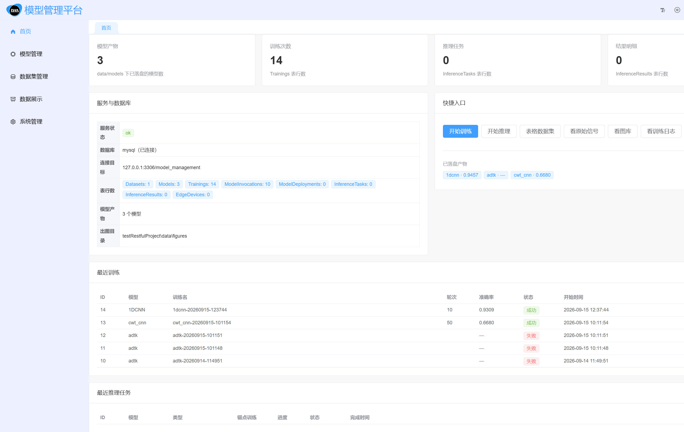

**页面内容自上而下分为四块：**

| 区块 | 内容 |
|---|---|
| **KPI 卡片** | 模型产物数、训练次数、推理任务数、结果明细数 |
| **服务与数据库** | 服务状态、数据库连接状态、连接目标、8 张表行数 |
| **模型产物** | 已落盘模型清单及其指标 |
| **快捷入口** | 刷新 / 开始训练 / 开始推理 / 表格数据集 / 看原始信号 / 看图库 / 看训练日志 |

**典型操作：** 点击「快捷入口」中的按钮可直接跳转到对应功能；点击「刷新」重新拉取最新数据。

图中可见：模型产物 3 个、训练次数 14 次、数据库 `mysql（已连接）`，说明后端与数据库链路正常。

---

### 4.2 模型管理

这是平台的核心模块，集中了模型的全部操作。页面顶部有五个子标签页。

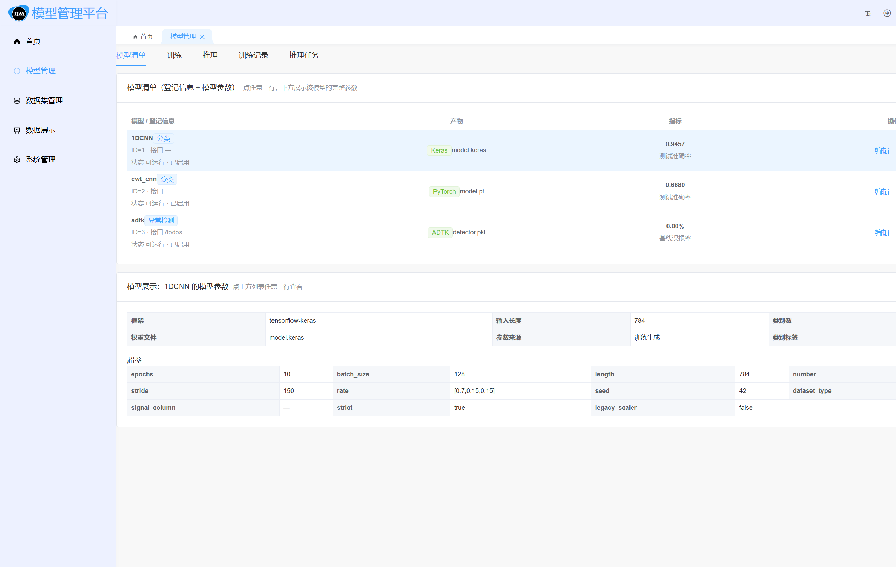

#### 4.2.1 模型清单

「模型清单」标签页展示所有已登记的模型，表格共四列：

| 列 | 含义 |
|---|---|
| **模型 / 登记信息** | 模型名、类型（分类/异常检测）、数据库 ID、状态 |
| **产物** | 框架类型与权重文件名（如 `Keras / model.keras`） |
| **指标** | 分类模型显示测试准确率；异常检测模型显示基线误报率 |
| **操作** | 「编辑」改名/改描述；「删除」删除产物 |

**查看模型详细参数：**

点击表格中**任意一行**，页面下方会展开该模型的完整参数卡，包含：

- **基本信息**：框架、输入长度、类别数、权重文件、类别标签数
- **超参数**：epochs、batch_size、length、number、stride、rate、seed、dataset_type 等
- **meta.json 全文**：产物元数据的原始内容

上图即为点击 `1DCNN` 行后展开的结果，可见输入长度 `784`、类别数 `10`、权重文件 `model.keras` 等信息。

#### 4.2.2 训练模型

切换到「训练」标签页，点击「开始训练」按钮，弹出训练参数配置窗口。

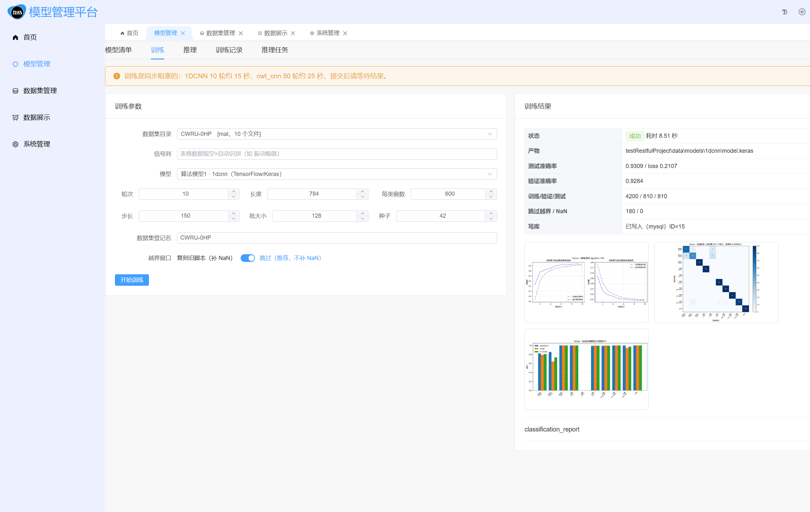

**操作步骤：**

1. 在「训练」标签页点击 **「开始训练」**
2. 在弹窗中选择模型（1dcnn / cwt_cnn / adtk）
3. 按需调整超参数（`epochs` 轮次、`batch_size` 批大小、`length` 窗口长度、`number` 窗口数、`stride` 步长等）
4. 点击「确 定」提交

> ⚠️ **训练是同步阻塞的**：请求发出后需要等待训练完成（1DCNN 训练 10 轮约 15 秒）。
> 训练期间界面会等待，属于正常现象，不是卡死。

**训练完成后自动发生三件事：**

1. **产物落盘** → `data/models/<模型名>/{权重文件, scaler.npz, meta.json}`
2. **自动出图** → `data/figures/<模型名>/` 下生成训练曲线、混淆矩阵、每类指标图
3. **写入数据库** → `Trainings` 表新增一行记录（**失败也会写一行**，状态标为"失败"，便于追溯）

> ⚠️ **一个模型只有一份产物**。重新训练会**直接替换**旧产物，不保留版本号。

#### 4.2.3 推理

切换到「推理」标签页进行模型推理。

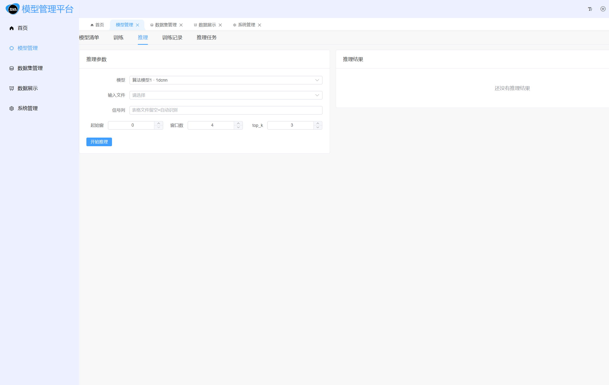

**操作步骤：**

1. 选择要使用的模型
2. 选择数据源（内置 CWRU 数据集文件，或上传的表格数据集）
3. 指定起始窗口（`index`）与窗口数量（`limit`）
4. 点击「开始推理」

**推理结果包含：**

- **分类模型**：预测类别 + 各类别置信度（top-k）
- **异常检测模型**：是否异常 + 异常分数 + 判定阈值 + 相对正常倍数
- 若推理输入来自已登记的数据集文件，还会自动补充**真实类别**，可直接看出预测对错

**推理完成后落库：**

| 表 | 记录内容 |
|---|---|
| `InferenceTasks` | 一次推理任务（模型、输入路径、参数、状态、输出图目录） |
| `InferenceResults` | 每条样本的结果（窗口序号、预测类别、置信度、是否异常、异常分数） |
| `ModelInvocations` | 调用的请求/响应原文、耗时、状态码、客户端 IP |

#### 4.2.4 上传模型

点击工具栏的 **「上传模型」** 按钮，弹出上传窗口。

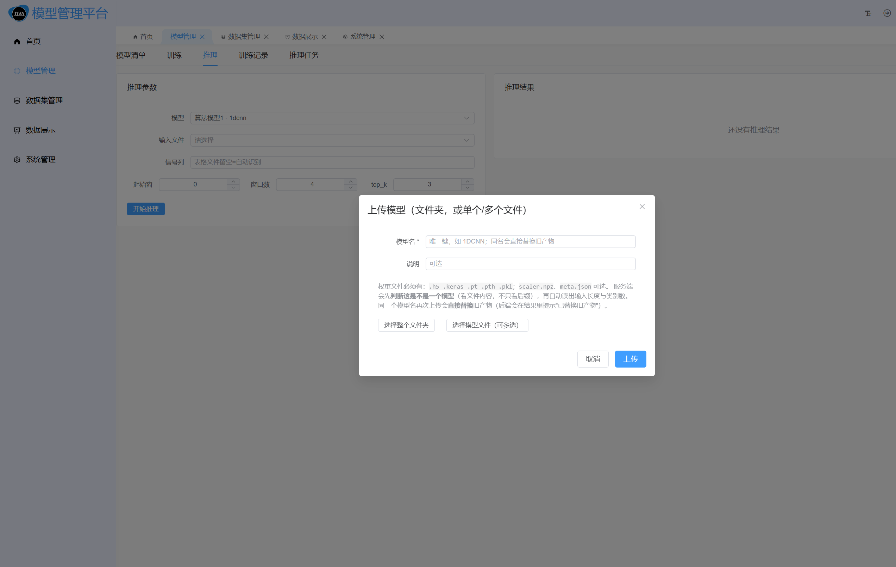

**两种上传方式：**

| 按钮 | 用途 |
|---|---|
| **选择整个文件夹** | 一次上传权重 + scaler.npz + meta.json |
| **选择模型文件（可多选）** | 单独上传一个或多个模型文件 |

**平台会自动完成三件事，无需手工填写参数：**

1. **判断"这是不是一个模型"** —— 不是只看后缀，而是**打开文件看内容**：
   - `.h5` → 检查是否为 HDF5 且含 Keras 存档结构
   - `.keras` → 检查是否为含 `config.json` 的 zip 包
   - `.pt` / `.pth` → 检查是否含 PyTorch 的 `data.pkl`
   - `.pkl` → 检查是否为 pickle 格式（**不反序列化**，避免上传即执行代码）
2. **自动读取参数** —— 从权重里解析出输入长度与类别数
3. **自动登记** —— 在数据库 `Models` 表中创建登记行

> ⚠️ **同名再上传 = 直接替换旧产物**，响应中会返回 `replaced: true` 并给出提示。

#### 4.2.5 训练记录 / 推理任务

- **训练记录**：读取 `Trainings` 表，展示每次训练的轮次、准确率、状态、时间
- **推理任务**：读取 `InferenceTasks` + `InferenceResults`，可展开查看每条样本的推理明细

---

### 4.3 数据集管理

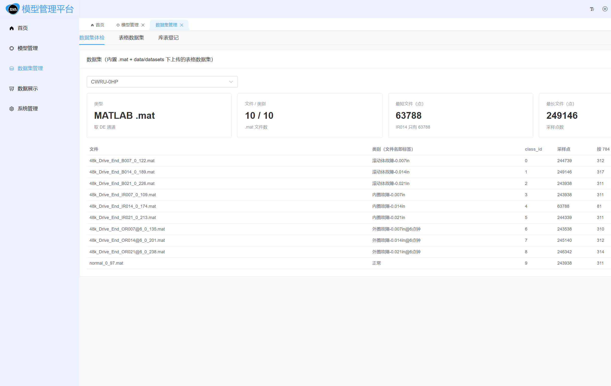

页面分为三块：

| 区块 | 功能 |
|---|---|
| **数据集体检** | 列出内置 CWRU 数据集与已上传的表格数据集，显示样本数、类别数、路径 |
| **表格数据集** | 上传 Excel/CSV 文件，预览列统计与前 N 行，可切换信号列 |
| **库表登记** | 读写数据库 `Datasets` 表 |

**两套数据源的约定：**

| 数据源 | 位置 | 格式 | 约定 |
|---|---|---|---|
| **CWRU 0HP**（内置只读） | `testRestfulProject/1DCNN/0HP/*.mat` | MATLAB `.mat` | **一个文件 = 一个类别**，共 10 类 |
| **表格数据集**（可上传） | `testRestfulProject/data/datasets/<数据集名>/` | `.csv .txt .xlsx .xls` | **一个文件 = 一个类别，文件名即标签** |

**信号列自动识别：** 对于表格数据，平台会自动挑选信号列 —— 列名含"振动幅值/加速度/signal"等关键词的列会被优先选中，而"时间""温度"等干扰列会被自动跳过。也可手动指定信号列。

---

### 4.4 数据展示

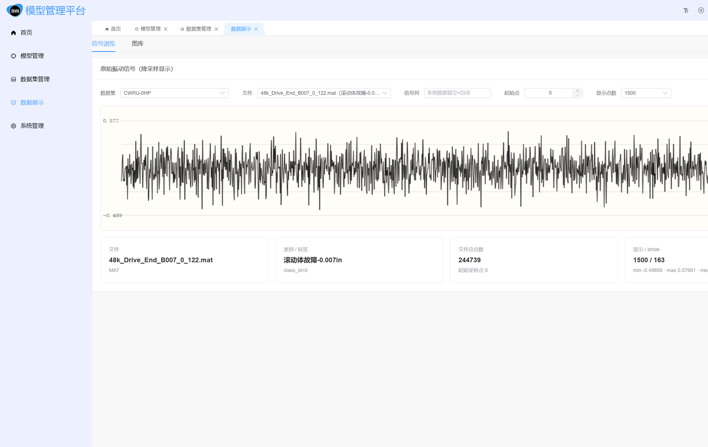

| 区块 | 功能 |
|---|---|
| **信号浏览** | 选择数据集 / 文件 / 信号列 / 起始点，用 canvas 绘制波形并显示统计量 |
| **图库** | 展示训练与推理自动生成的图，支持过滤与点击放大 |

图库中的图由后端 `figures.py` 用 matplotlib（Agg 无头后端）自动生成，包括：

- `training_curves.png` —— 训练/验证曲线
- `confusion_matrix.png` —— 混淆矩阵
- `per_class_metrics.png` —— 每类准确率/召回率
- `prediction_distribution.png` —— 推理结果分布
- `predicted_windows.png` —— 被判定异常/预测到的窗口波形

---

### 4.5 系统管理

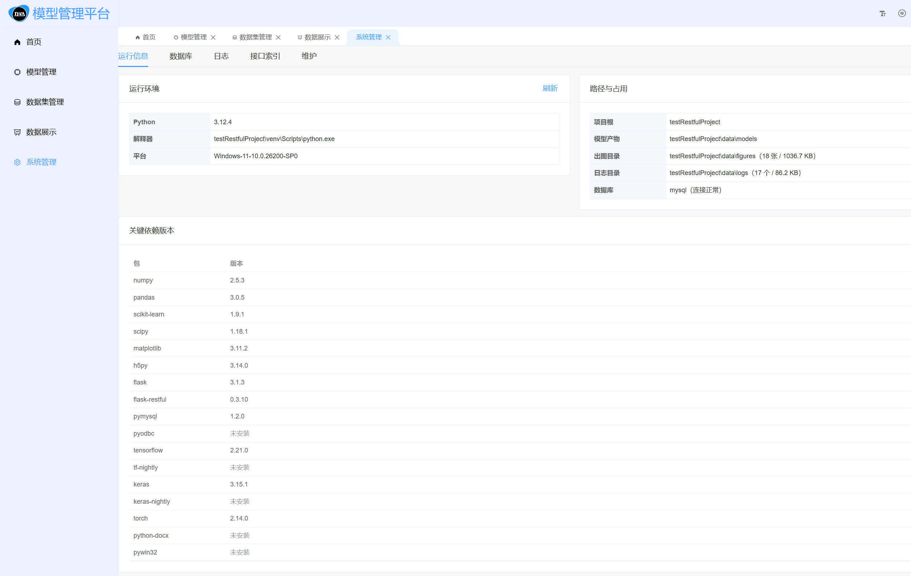

| 区块 | 功能 |
|---|---|
| **运行信息** | Python 版本、关键依赖版本、路径、磁盘占用 |
| **数据库** | 连接状态与 8 张表的行数 |
| **日志** | 训练日志列表与尾部内容（`data/logs/train-<模型>-<时间>.log`） |
| **接口索引** | 列出全部业务接口及其用途 |
| **维护** | 清空图库、删除模型产物（红色按钮 + 二次确认） |

**8 张数据表：**

| 表 | 用途 |
|---|---|
| `Datasets` | 数据集登记 |
| `Models` | 模型登记 |
| `Trainings` | 训练记录 |
| `ModelInvocations` | 每次推理调用的请求/响应审计 |
| `ModelDeployments` | 模型部署（预留，未接入） |
| `InferenceTasks` | 推理任务 |
| `InferenceResults` | 推理结果明细 |
| `EdgeDevices` | 边缘设备（预留，未接入） |

---

## 5. 模型调用方式

平台提供**三种调用方式**，从易到难分别是：界面调用、HTTP 接口调用、Python 代码调用。三者最终都走同一套后端逻辑，结果完全一致。

### 5.1 调用链路总览

```
                    ┌──────────────────────┐
   方式一 界面操作 → │                      │
                    │   后端 /predict      │ → 读产物 → 切窗 → 校验 → 模型推理
   方式二 HTTP   → │   后端 /train        │ → 落盘产物 → 出图 → 写数据库
                    │                      │
   方式三 代码   → └──────────────────────┘
```

三种方式的分工：

| 方式 | 适用场景 | 入口 |
|---|---|---|
| **界面调用** | 日常操作、演示、验收 | 浏览器 <http://localhost:8080> |
| **HTTP 接口** | 与其他系统集成、脚本批量调用 | `http://127.0.0.1:5000/...` |
| **Python 代码** | 在 Python 项目中直接调用 | `model_service.inference.predict()` |

---

### 5.2 方式一：界面调用

这是最常用的方式，全程图形化操作，无需接触命令行。

**训练一个模型的完整流程：**

1. 左侧菜单进入 **「模型管理」**
2. 切换到 **「训练」** 标签页
3. 点击 **「开始训练」** 按钮
4. 在弹窗中选择模型并配置参数


5. 点击「确 定」，等待训练完成（同步阻塞，1DCNN 约 15 秒）
6. 训练结束后回到「模型清单」标签页，点击该模型行即可看到更新后的指标

**推理的完整流程：**

1. 左侧菜单进入 **「模型管理」**
2. 切换到 **「推理」** 标签页


3. 选择模型 → 选择数据源 → 填写起始窗口与数量
4. 点击「开始推理」，结果直接显示在下方表格中
5. 若要查看历史推理，切换到「推理任务」标签页

---

### 5.3 方式二：HTTP 接口调用

后端在 `http://127.0.0.1:5000` 暴露 REST 风格接口，返回**裸 JSON**（不带 `{code, data, msg}` 信封）。

#### 5.3.1 健康检查

```http
GET http://127.0.0.1:5000/health
```

返回服务、数据库、产物的整体状态，用于确认后端是否就绪。

#### 5.3.2 训练模型

```http
POST http://127.0.0.1:5000/train
Content-Type: application/json
```

**请求体示例（训练 1DCNN 10 轮）：**

```json
{
  "model": "1dcnn",
  "epochs": 10
}
```

**常用参数：**

| 参数 | 含义 | 默认值 |
|---|---|---|
| `model` | 模型名（`1dcnn` / `cwt_cnn` / `adtk`） | `1dcnn` |
| `epochs` | 训练轮次（上限 200） | 10 |
| `batch_size` | 批大小 | 128 |
| `length` | 每窗口采样点数 | 784 |
| `number` | 窗口数量 | 600 |
| `stride` | 滑窗步长 | 150 |
| `dataset_type` | 数据源类型（`matlab` / `tabular`） | `matlab` |
| `dataset_dir` | 数据集目录 | `1DCNN/0HP` |

**命令行示例（PowerShell）：**

```powershell
$body = @{ model='1dcnn'; epochs=10 } | ConvertTo-Json
Invoke-RestMethod -Uri "http://127.0.0.1:5000/train" -Method POST `
  -Body $body -ContentType "application/json"
```

**训练 adtk（无监督异常检测）：**

```powershell
$body = @{ model='adtk'; k=4; feature_mode='stats'; threshold_quantile=0.995 } | ConvertTo-Json
Invoke-RestMethod -Uri "http://127.0.0.1:5000/train" -Method POST `
  -Body $body -ContentType "application/json"
```

#### 5.3.3 推理

```http
POST http://127.0.0.1:5000/predict
Content-Type: application/json
```

**请求体示例（用 adtk 检测一个内圈故障文件）：**

```json
{
  "model": "adtk",
  "path": "1DCNN/0HP/48k_Drive_End_IR007_0_109.mat",
  "index": 0,
  "limit": 3
}
```

**参数说明：**

| 参数 | 含义 |
|---|---|
| `model` | 使用的模型名 |
| `path` | 数据文件路径（相对工作区），或改用 `samples` 直接传数组 |
| `index` | 从第几个窗口开始（窗口序号） |
| `limit` | 推理多少个窗口 |
| `top_k` | 分类模型返回前 K 个类别的置信度，默认 3 |
| `column` | 表格数据集的信号列（可选） |

**真实响应示例**（本机实际调用结果，`adtk` 检测内圈故障文件）：

```json
{
  "model": "adtk",
  "framework": "adtk",
  "task": "anomaly_detection",
  "input_len": 784,
  "count": 3,
  "input": {
    "source": "path",
    "path": ".../1DCNN/0HP/48k_Drive_End_IR007_0_109.mat",
    "format": "matlab",
    "signal_points": 243938,
    "window_index": 0,
    "limit": 3
  },
  "predictions": [
    {
      "index": 0,
      "is_anomaly": true,
      "anomaly_score": 0.245888,
      "predicted_class": 1,
      "predicted_label": "异常",
      "predicted_category": "AnomalyDetection",
      "detail": {
        "detector": "PcaAD",
        "feature_mode": "stats",
        "重构误差": 0.245888,
        "判定阈值": 0.001588,
        "正常分数中位": 0.000144,
        "相对正常倍数": 1702.25
      },
      "actual_class": 3
    }
  ],
  "summary": { "异常样本": 3, "正常样本": 0 }
}
```

**结果解读：** 该窗口重构误差 `0.2459` 远超判定阈值 `0.0016`，是正常信号中位数的 **1702 倍**，因此判定为「异常」。三个窗口全部命中，与故障文件的事实相符。

#### 5.3.4 常用接口一览

| 方法 | 路径 | 用途 |
|---|---|---|
| GET | `/health` | 服务/数据库/产物体检 |
| GET | `/models` | 模型产物清单 + 库表登记 |
| GET | `/models/<名>/overview` | 模型档案（登记 + 参数 + 指标 + 最近训练） |
| POST | `/models/upload` | 上传模型（multipart） |
| POST | `/train` | 训练（同步阻塞） |
| GET | `/trainings?limit=N` | 训练记录 |
| POST | `/predict` | 推理 |
| GET | `/inference-tasks?limit=N` | 推理任务列表 |
| GET | `/inference-tasks/<id>` | 任务 + 逐行结果 |
| GET | `/datasets` | 数据集体检 |
| POST | `/datasets/upload` | 上传表格数据集 |
| GET | `/figures?limit=N` | 已生成的图列表 |
| GET | `/system` | 运行信息与各表行数 |
| GET | `/system/logs` | 训练日志列表 |

> 完整清单可直接访问 <http://127.0.0.1:5000/api> 查看接口索引。

---

### 5.4 方式三：Python 代码调用

在 `testRestfulProject` 目录下，可直接 import 业务模块调用，**不经过 HTTP**，适合写脚本或做批量实验。

```python
# 需在 testRestfulProject 目录下执行，且使用 venv 中的 Python
from model_service import inference

result = inference.predict(
    model="adtk",
    path="1DCNN/0HP/48k_Drive_End_IR007_0_109.mat",
    index=0,
    limit=3,
    write_db=False,        # 不写数据库（做实验时建议关掉，避免污染审计记录）
)

for p in result["predictions"]:
    print(p["index"], p["is_anomaly"], p["anomaly_score"])
```

**调用训练：**

```python
from model_service import training

report = training.train("1dcnn", {"epochs": 10})
print(report["status"], report["metrics"])
```

**读取模型产物：**

```python
from model_service import registry

artifact = registry.load_artifact("1dcnn")
print(artifact.framework)              # tensorflow-keras
print(artifact.meta["input_len"])      # 784
print(artifact.meta["labels"])         # 10 个类别标签
```

---

### 5.5 请求 / 响应字段说明

#### 推理响应的关键字段

| 字段 | 含义 |
|---|---|
| `model` / `framework` / `task` | 使用的模型、框架、任务类型 |
| `input_len` | 本次推理使用的窗口长度（以产物记录的为准） |
| `predictions[].is_anomaly` | **异常检测专属**：是否判定为异常 |
| `predictions[].anomaly_score` | **异常检测专属**：连续异常分数（越大越异常） |
| `predictions[].predicted_label` | 预测标签（分类为故障类型，异常检测为「正常」/「异常」） |
| `predictions[].detail.判定阈值` | 异常判定阈值（由正常基线信号的 99.5 分位得出） |
| `predictions[].actual_class` | **真实类别**（仅当输入来自已登记数据集时提供） |
| `summary` | 结果汇总（各预测类别的计数） |
| `figures` / `figures_dir` | 本次推理自动生成的图 |
| `db` | 落库回执（写入是否成功、各表影响行数） |

#### 错误码约定

| 状态码 | 含义 | 处理方式 |
|---|---|---|
| `200` | 成功 | — |
| `400` | 输入非法（长度不符、含 NaN、窗口越界） | 检查请求参数与数据文件 |
| `409` | 模型产物缺失 | 先调用 `/train` 训练，或 `/models/upload` 上传 |
| `500` | 服务内部错误 | 查看后端控制台日志与 `data/logs/` |

---

## 6. 关键代码片段说明

本节展示平台核心逻辑的**真实源码**（截图直接取自项目文件，未做改写）。

### 6.1 训练入口 `train()`

文件：`testRestfulProject/model_service/training.py`

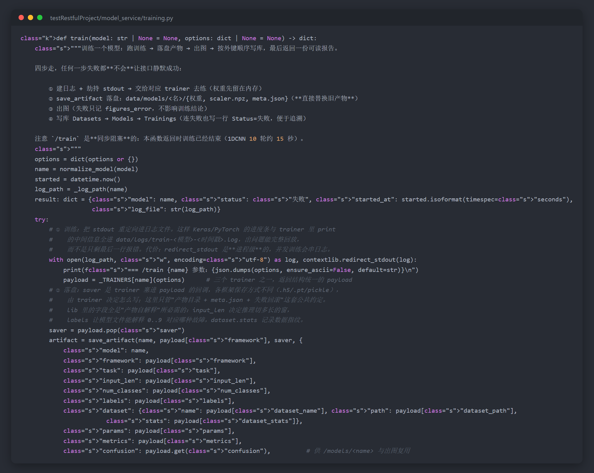

**这段代码做了什么：**

训练被设计成**四步走**，任何一步失败都不会让接口静默成功：

| 步骤 | 动作 | 说明 |
|---|---|---|
| ① | 建日志 + 重定向 stdout | Keras/PyTorch 的进度条与中间输出全进日志文件，出问题能完整回放 |
| ② | `save_artifact()` 落盘 | 写入 `data/models/<名>/`，**直接替换旧产物** |
| ③ | 出图 | 失败只记录 `figures_error`，不影响训练结论 |
| ④ | 写数据库 | 按外键顺序写 `Datasets → Models → Trainings`，**失败也写一行**便于追溯 |

**关键设计点：**

- `options = dict(options or {})` —— 防御性拷贝，避免外部改动影响内部逻辑
- `contextlib.redirect_stdout(log)` —— 把整个训练的 stdout 收进日志
- `payload.pop("saver")` —— 各框架保存方式不同（`.h5`/`.pt`/`.pkl`），由 trainer 通过回调决定，公共逻辑只管"产物目录 + meta.json + 失败回滚"这套约定
- `"trusted": True` —— 本机训练产物可信（推理侧会反序列化 `.pkl`）

### 6.2 推理入口 `predict()`

文件：`testRestfulProject/model_service/inference.py`

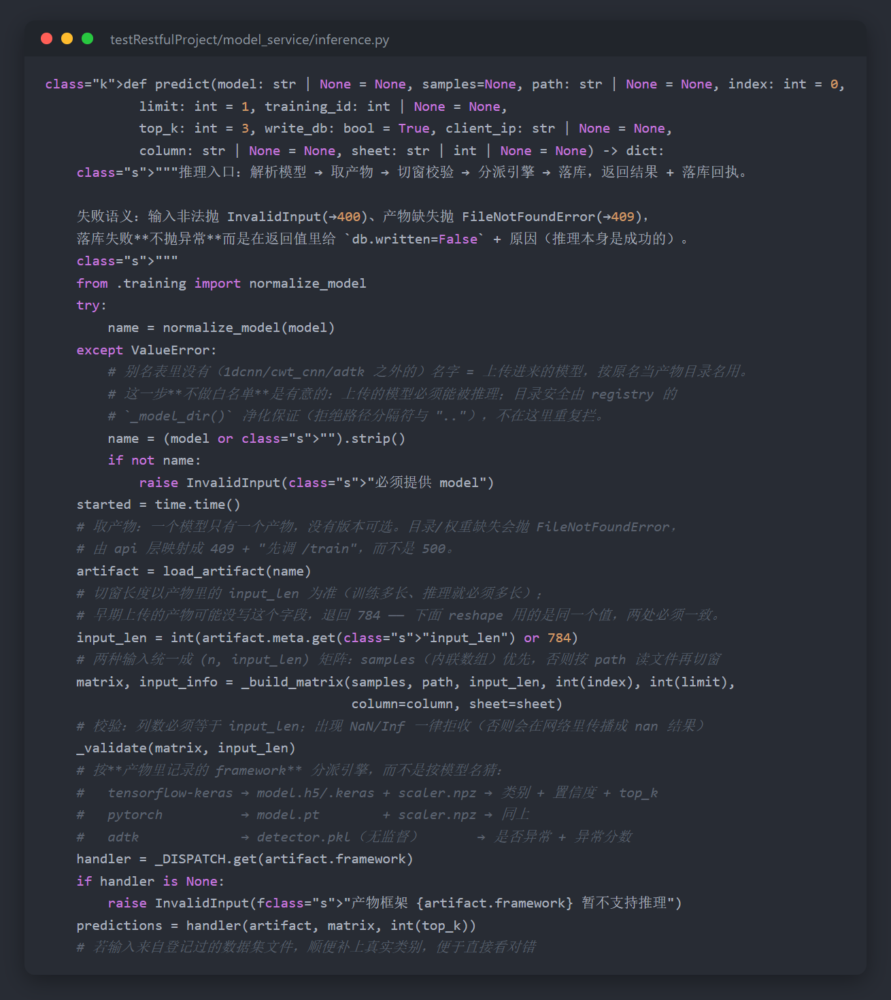

**这段代码做了什么：**

推理的流程是「解析模型 → 取产物 → 切窗校验 → 分派引擎 → 落库」：

| 步骤 | 说明 |
|---|---|
| **解析模型名** | 先查别名表；查不到说明是上传的模型，按原名当产物目录名 |
| **取产物** | `load_artifact()` 读 `meta.json`；缺失则抛 `FileNotFoundError`（映射为 409，提示"先调 /train"） |
| **确定窗口长度** | 以**产物里的 `input_len` 为准**（训练多长，推理就必须多长） |
| **构建输入矩阵** | `samples`（内联数组）优先，否则按 `path` 读文件切窗 |
| **校验** | 列数必须等于 `input_len`；出现 `NaN`/`Inf` 一律拒收 |
| **分派引擎** | 按**产物里记录的 framework** 分派，而不是按模型名猜 |
| **落库** | 写 `InferenceTasks` + `InferenceResults` + `ModelInvocations` |

**关键设计点：**

- **按 framework 分派而非按名字猜** —— 这样上传的任意模型只要框架已知就能推理：

  | framework | 产物 | 输出 |
  |---|---|---|
  | `tensorflow-keras` | `model.h5` / `.keras` + `scaler.npz` | 类别 + 置信度 + top-k |
  | `pytorch` | `model.pt` + `scaler.npz` | 同上 |
  | `adtk` | `detector.pkl`（无监督） | 是否异常 + 异常分数 |

- **失败语义明确** —— 输入非法抛 `InvalidInput`（→400）、产物缺失抛 `FileNotFoundError`（→409）；而**落库失败不抛异常**，只在返回值的 `db.written=False` 里说明原因（推理本身是成功的）

### 6.3 模型登记表 `MODEL_META`

文件：`testRestfulProject/model_service/training.py`

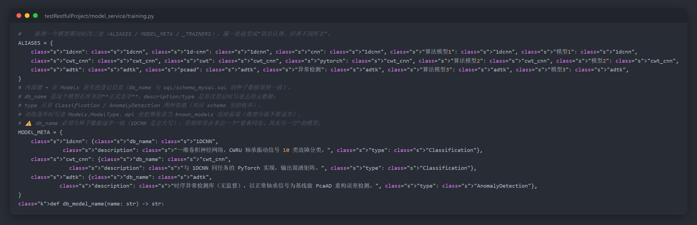

**这段代码说明了模型的"三套写法"：**

```
接口别名  --normalize_model-->  内部键  --db_model_name-->  库表 Models 里的名字
  "CNN"           ↓            "1dcnn"         ↓              "1DCNN"
  "模型1"                   (目录名/分派键)                  (种子数据名)
```

| 概念 | 作用 | 示例 |
|---|---|---|
| **ALIASES** | 把用户可能写的各种叫法统一到内部键 | `cnn` / `模型1` / `1d-cnn` → `1dcnn` |
| **内部键** | 同时是 `data/models/<键>/` 的目录名与 `_TRAINERS` 的字典键 | `1dcnn` |
| **db_name** | 在数据库 `Models` 表里的正式名字 | `1DCNN`（全大写，与种子数据一致） |

**关键设计点：**

- `normalize_model()` 认不出来时**直接抛 `ValueError`，不退回默认值** —— 静默换成另一个模型去训练，用户从返回里看不出来
- `db_name` 必须与种子数据**逐字一致**（`1DCNN` 是全大写），否则库里会多出一个"看着同名、其实另一行"的模型

### 6.4 接口注册表 `_ROUTES`

文件：`testRestfulProject/model_service/api.py`

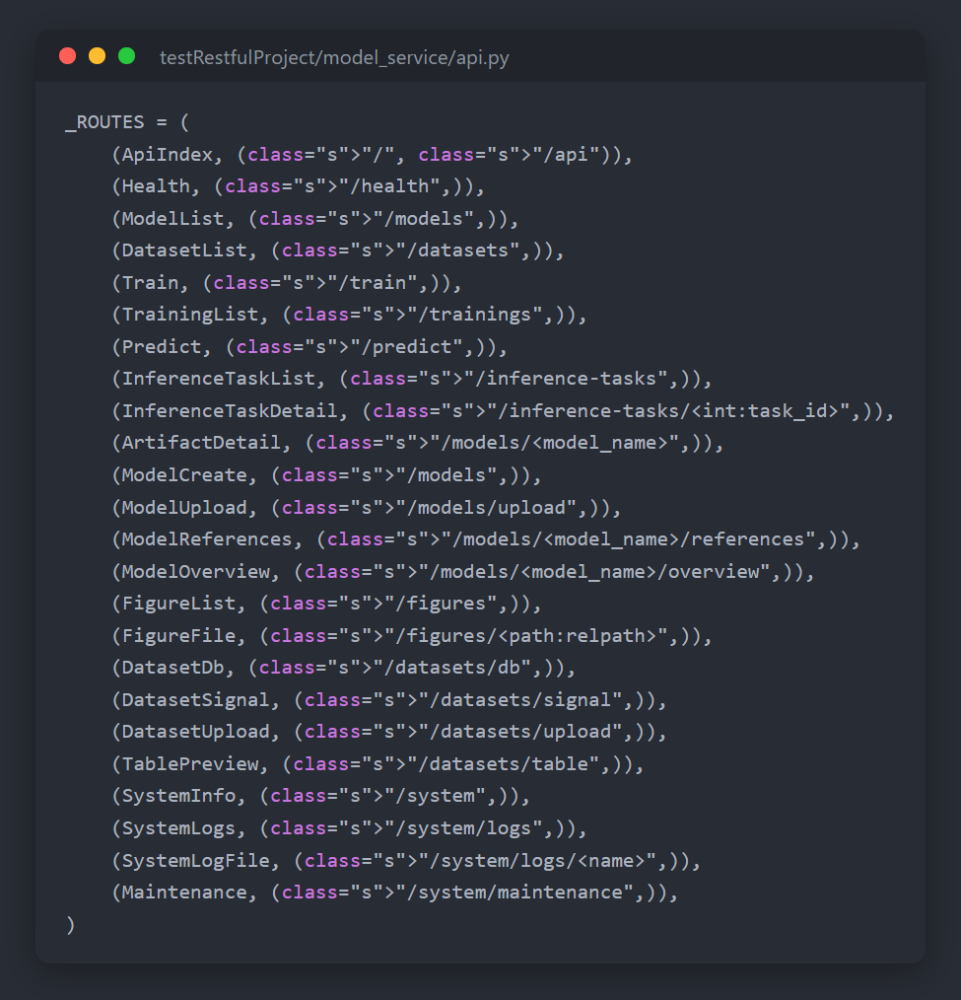

**这段代码是全部业务接口的"唯一真相"：**

- 每个元组是 `(资源类, 路径元组)`，一个资源类可挂多个路径
- 接口索引页的说明文字**直接取各资源类的 docstring 首行**，不再手抄一份 —— 改了代码，索引自动跟着变

**关键设计点：**

- ⚠️ `/` 与 `/api` 是**一次 `add_resource` 挂两个 URL**。不能拆成两次调用 —— `flask_restful` 用"类名小写"当 endpoint，第二个同名 endpoint 会直接 `AssertionError`
- `_install_path_mask(api)` 是**出口脱敏**：挂在 `app.after_request` 上，保证响应里不再出现本机真实目录

### 6.5 前端接口封装

文件：`frontend/22project/src/api/platform/index.ts`

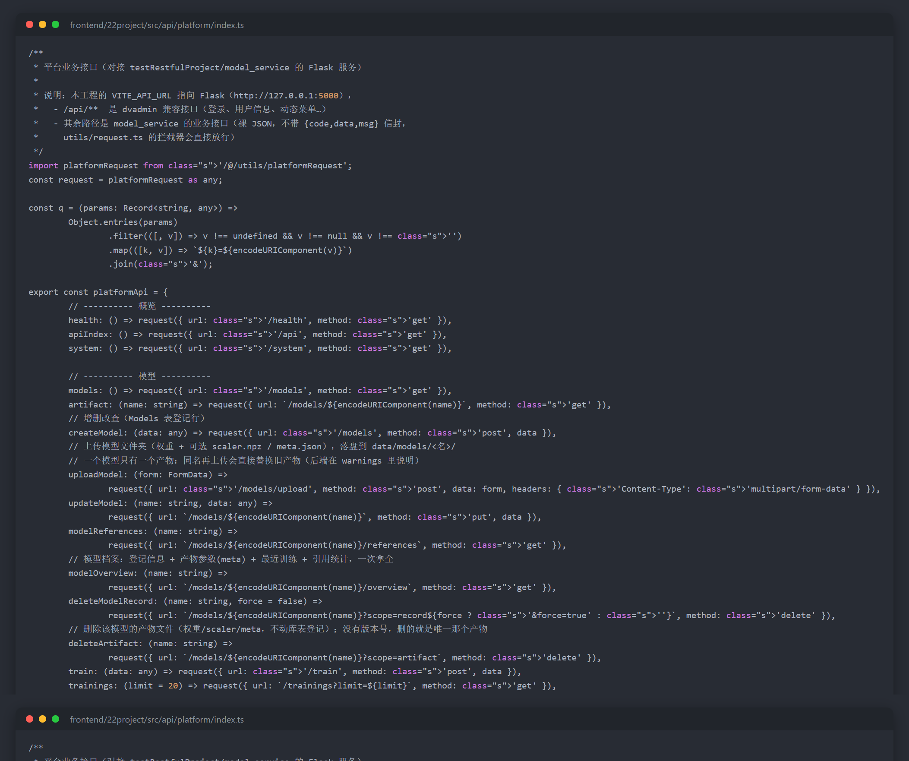

**这段代码是前端调用后端的统一入口：**

所有平台业务接口都集中在这个 `platformApi` 对象里，页面只调用 `platformApi.train(...)` 这样的方法，不直接写 URL。

**关键设计点：**

- **使用 `platformRequest` 而非框架默认的 request** —— 这是整个前端最关键的一处定制：

  | | 框架默认 `utils/request.ts` | 平台专用 `utils/platformRequest.ts` |
  |---|---|---|
  | 校验 `{code, data, msg}` 信封 | **强制校验** | **不校验，直接返回 `response.data`** |
  | 适用接口 | dvadmin 兼容接口（登录/菜单/权限） | model_service 业务接口（裸 JSON） |

  若不使用专用实例，所有业务请求都会报 `非标准返回：[object Object]`。

- **`fileUrl()` 统一处理图片地址** —— `VITE_API_URL` 可能是绝对地址（`http://127.0.0.1:5000`）也可能是前缀（`/api`），此函数统一拼接，避免页面里到处写判断

---

## 7. 常见问题排查

| 现象 | 原因 | 处理方式 |
|---|---|---|
| **打不开 <http://localhost:8080>** | 前端端口回落到 5173 | 检查 `.env.development` 是否有 `VITE_PORT = 8080`；确认 `npm run dev` 已启动 |
| **页面能开但一直白屏** | 前端启动期抛异常（如 i18n 崩溃） | 按 F12 看 Console 报错；确认 `src/i18n/index.ts` 的语言初始化逻辑正确 |
| **登录后不跳转** | 登录响应缺 `pwd_change_count` 字段 | 检查后端 `dvadmin.py` 的登录返回 |
| **所有数据为空，控制台报 `非标准返回：[object Object]`** | 业务接口走了框架的信封校验 | 确认页面使用的是 `utils/platformRequest.ts` 实例 |
| **跨域被拦（CORS preflight 失败）** | 后端改了路由但没重启 | **重启后端**（改路由注册必须重启，debug 自动重载不重注册蓝图） |
| **推理报"模型产物缺失"（409）** | 该模型还没有产物 | 先调用 `/train` 训练，或用 `/models/upload` 上传产物 |
| **推理报 500，日志显示 `No module named 'xxx'`** | venv 缺少依赖 | `venv\Scripts\python.exe -m pip install <缺失的包>` |
| **训练报"数据集目录不存在"** | `dataset_dir` 路径不对 | 使用工作区相对路径，如 `1DCNN/0HP` |
| **上传数据集后列表看不到** | 体检结果有 120 秒 TTL 缓存 | 稍等或刷新页面（上传后平台会主动清缓存） |
| **切页面很慢（3~10 秒）** | `main.ts` 里为让改动立即生效加了整页刷新 | 属预期行为；不需要时可删掉标注 ② 的那段代码 |

### 依赖缺失的补充说明

平台依赖较特殊（TensorFlow、PyTorch、adtk 同时存在），`requirements.txt` 已列出完整清单。

> ⚠️ 特别注意：`adtk` 是**源码内置**在项目里的（`testRestfulProject/adtk/`），它额外依赖
> **`tabulate`** 和 **`statsmodels`**。这两个包在部分环境下会被遗漏，导致 adtk 推理直接报
> `ModuleNotFoundError`。`requirements.txt` 中已补上，若换机器部署请注意核对。

---

## 附录：目录结构

```
D:\HUAT\22project\
├─ testRestfulProject\                   后端
│  ├─ main.py                            唯一入口
│  ├─ model_service\                     业务包（11 个模块）
│  │  ├─ api.py                          业务接口（裸 JSON）
│  │  ├─ dvadmin.py                      前端兼容层（信封 + CORS）
│  │  ├─ training.py                     训练编排 + 三个 trainer
│  │  ├─ inference.py                    推理 + 落库
│  │  ├─ datasets.py / tabular.py        两套数据源
│  │  ├─ registry.py                     产物管理
│  │  ├─ db.py                           8 张表读写
│  │  └─ figures.py / config.py
│  ├─ data\models\<模型>\                ★ 模型产物（一个模型一份）
│  ├─ data\figures\ , logs\ , datasets\  图 / 日志 / 上传数据
│  ├─ sql\schema_mysql.sql               建表脚本
│  └─ db.env                             数据库配置
├─ frontend\22project\                   前端（Vue3 + Vite + Element Plus）
│  └─ src\{views\platform, api\platform, utils\platformRequest.ts}
├─ docs\                                 本文档与截图
└─ README.md · 项目交接文档.md · 项目技术详解.md
```

